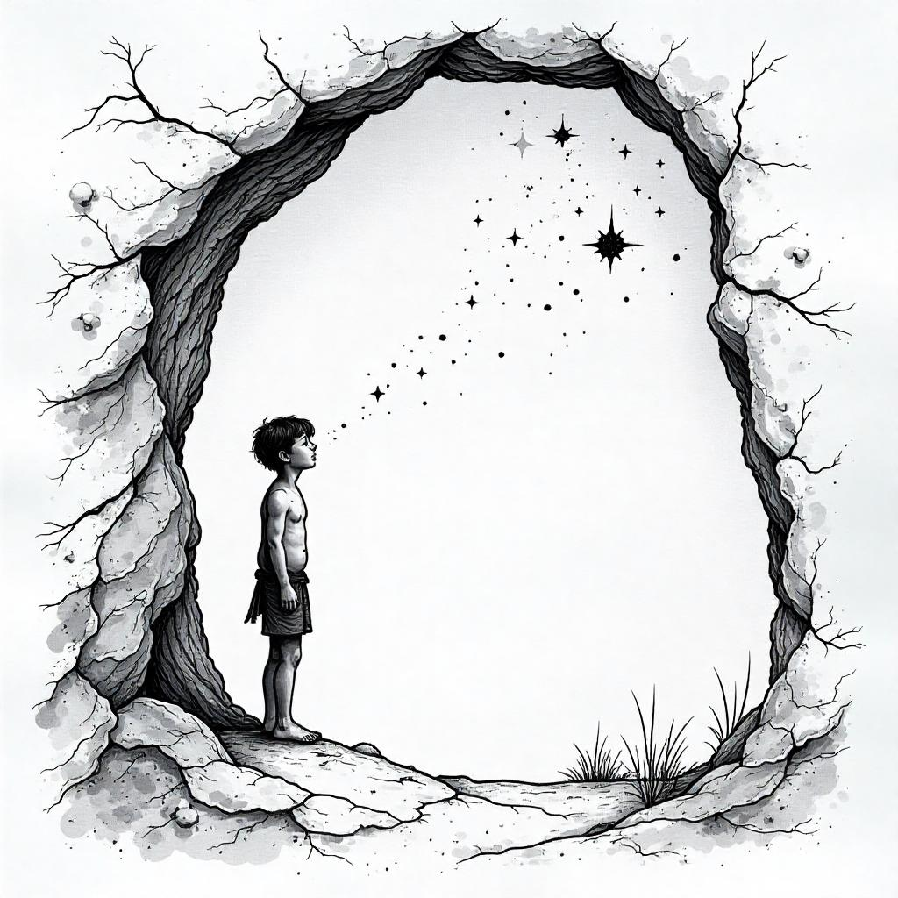

<head>
  <title>A Preliminary Mathematical Exegesis of Diffusion Models</title>
  <meta name="description" content="An in-depth mathematical analysis of diffusion models in machine learning.">
  <meta name="keywords" content="diffusion models, mathematics, machine learning, exegesis">
  <meta name="author" content="Shuyue Wang">
  <!-- Open Graph (for social sharing) -->
  <meta property="og:title" content="A Preliminary Mathematical Exegesis of Diffusion Models">
  <meta property="og:description" content="An in-depth mathematical analysis of diffusion models in machine learning.">
  <meta property="og:url" content="https://shuyuew1991.github.io/A-Preliminary-Mathematical-Exegesis-of-Diffusion-Models/">
  <meta property="og:type" content="website">
</head>

Chapter 1 - The High-Dimensional Structure of True Data

 

  

We kickstart our exegesis by reiterating the fundamental objective of diffusion models - To replicate what the nature offers, mostly in image generation. 
Consider a photograph taken from Shangrī-La, a hand-drawn portrait in the _Musée du Louvre_, or plants documented in _Amazonía_ —each constitutes a manifestation of nature’s visual repertoire. 
We formally designate such representations as natural images, and what we want is to replicate them at our will.

It is not difficult to understand, though, that being 'natural' for images is not the same with 'real'.
A "real" image is bound by the constraints of physical reality, whereas a "natural" image may include artistic interpretations, stylized elements, or idealized forms that still feel intuitively coherent. 
For instance, an impressionist painting or a dreamlike digital rendering can qualify as natural despite departing from strict realism. 
Diffusion models, therefore, aim not just for photorealism.

In each of the above natural image case, the visual input can be represented as a tensor. For instance,
> A \\(256 \times 256\\) image admits \\({2^8}^3 = 16,777,216\\) possible colors per pixel (where 3 represents 3 RGB channels and 8 refers to the bit depth of the channel). The total configuration space for pixel combinations therefore contains \\((16,777,216)^{256 \times 256}\\) distinct images.

That is a vast number that exceeds the estimated \\(10^{80}\\) atoms in the observable universe.

Randomly assigning values to pixels is more likely to degrade into meaningless noise rather than appear natural.
This can be empirically verified by generating random arrays (e.g., via `numpy.random.rand()`in python) and visualizing them using any standard image display tool.
Experience told us that such a disordered array of uncorrelated hues would diverge sharply from the characteristics of a typical natural image; in fact, only a vanishingly small fraction of these possible configurations correspond to meaningful images.

This is because natural images exhibit a structured harmony, where pixels organize into coherent objects, textures, and spatial relationships via the forms of edges, discernible shapes, and smooth luminance gradients.
While mathematically valid as tensors, these random permutations are exploiting the full combinatorial space without yielding meaningful representation.

**Maybe we can model _distribution of pixels_ that registers those patterns from real natural images statistically rather than relying on randomness?**

A natural image can be viewed as a sampled event from an underlying probability distribution over all possible pixel configurations.
In probability theory, an event, denoted by \\(x\\), represents a possible outcome of an experiment or observation, which may be either a scalar in one dimension or a tensor in multiple dimensions.
When considering images, \\(x\\) typically represents either meaningful natural images or random arrangements of pixels.  
The probability \\(p(x)\\) then quantifies the likelihood of event \\(x\\) occurring.  
It calculates the likelihood of observing a specific natural image among all possible pixel configurations.
In this framework, every natural image thus represents a sample drawn from an underlying probability distribution governing all possible pixel configurations.
A good \\(p(x)\\) should approach zero for random noise while assigning higher probability density to natural images.
With this foundation, our focus will now shift entirely to modeling the **true data distribution \\(p_{\text{data}}(x)\\)**, the underlying probability structure governing natural images.
For practitioners seeking to leverage generative AI—whether to develop custom models or satisfy theoretical curiosity—understanding this distribution's properties proves essential.

----

Now let's take a look at the high-dimensional tensor of noise with \\(d\\) pixels, each being independent with identically distributed (i.e. _i.i.d._) components.: 

$$
X=(X_1,X_2,…,X_d)
$$

We suppose \\(X_i\\) has finite variance \\(\sigma^2\\) (no matte what distribution it is under). 
We introduce L2-norm: 

$$∥X∥_2^2=\sum_{i=1}^dX_i^2.$$

Then we have 

$$\mathbb{E}[\|X\|_2^2]=d\cdot\mathbb{E}[X_i^2]$$

and  

$$\mathrm{Var}(\|X\|_2^2)=d⋅\mathrm{Var}(X_i^2)$$

due to linearity of expectations.
We calculate the ratio of  standard deviation vs.  mean, which we  refer to as _concentration ratio_: 

$$
\frac{\sqrt{\mathrm{Var}(∥X∥_2^2)}}{E[∥X∥_2^2]}=\frac{\sqrt{d⋅\mathrm{Var}(X_i^2)}}{d⋅E[X_i^2]} \propto  \frac{1}{\sqrt{d}}→0\quad\text{as }d \rightarrow \infty.
$$

Viewing this vanishing result, you can imagine a thin **shell** of noises tend to gather the sample when the dimension increases, with concentrated data (i.e. the images) around their mean.

We now check how this concentrated norm phenomenon for high-dimensional noise act in uniform and gaussian distributions, respectively ---

For \\(X_i \sim \text{Uniform}(-a,a)\\)，
>its probability density function is 
>
>$$f_{X_i}(x) = \frac{1}{2a}.$$
>
>The variance is: 
>
>$$\begin{align*}
>\mathrm{Var}(X_i^2) &= \mathbb{E}[X_i^4] - (\mathbb{E}[X_i^2])^2 \\
>                  &= \left( \int_{-a}^a x^4 \cdot \frac{1}{2a} \, dx \right) - \left( \int_{-a}^a x^2 \cdot \frac{1}{2a} \, dx \right)^2 \\
>                  &= \left( \frac{1}{2a} \left[ \frac{x^5}{5} \right]_{-a}^a \right) - \left( \frac{1}{2a} \left[ \frac{x^3}{3} \right]_{-a}^a \right)^2 \\
>                  &= \frac{a^4}{5} - \left( \frac{a^2}{3} \right)^2 \\
>                  &= \frac{4a^4}{45}
>\end{align*}$$
>
>
>We have: 
>
>$$\mathbb{E}[\|X\|_2^2] = d \cdot \mathbb{E}[X_i^2] = d \cdot \frac{a^2}{3},$$
>
>so 
>
>$$\|X\|_2 \approx \sqrt{\mathbb{E}[\|X\|_2^2]} = a \sqrt{\frac{d}{3}}.$$
>
>Also, we have:
>
>$$\mathrm{Var}(\|X\|_2^2) = d \cdot \mathrm{Var}(X_i^2) = d \cdot \frac{4a^4}{45},$$
>
>so
>
>$$\sigma_{\|X\|_2^2} = \frac{2a^2 \sqrt{d}}{\sqrt{45}} = \frac{2a^2 \sqrt{d}}{3 \sqrt{5}}.$$
>
>The concentration ratio vanishes in the uniform distribution:  
>
>$$\frac{\sigma_{\|X\|_2^2}}{\mathbb{E}[\|X\|_2^2]} = \frac{2a^2 \sqrt{d} / (3 \sqrt{5})}{d a^2 / 3} = \frac{2}{\sqrt{5d}}\to 0\text{ as }d \to \infty.$$

For \\(X_i \sim \mathcal{N}(0, \sigma^2)\\), 
>its probability density function is: 
>
>$$f_{X_i}(x) = \frac{1}{\sqrt{2\pi\sigma^2}} e^{-\frac{x^2}{2\sigma^2}}.$$
>
>The variance of \\(X_i^2\\): 
>
>$$\begin{align*}
>\mathrm{Var}(X_i^2) &= \mathbb{E}[X_i^4] - \left(\mathbb{E}[X_i^2]\right)^2 \\
>                 &= \left( \int_{-\infty}^{\infty} x^4 f_{X_i}(x) \, dx \right) - \left( \int_{-\infty}^{\infty} x^2 f_{X_i}(x) \, dx \right)^2 \\
>                 &= \left( \frac{1}{\sqrt{2\pi\sigma^2}} \int_{-\infty}^{\infty} x^4 e^{-\frac{x^2}{2\sigma^2}} \, dx \right) 
>                    - \left( \frac{1}{\sqrt{2\pi\sigma^2}} \int_{-\infty}^{\infty} x^2 e^{-\frac{x^2}{2\sigma^2}} \, dx \right)^2 \\
>                 &= \left( \frac{1}{\sqrt{2\pi\sigma^2}} \cdot 3\sqrt{2\pi}\sigma^5 \right) 
>                    - \left( \frac{1}{\sqrt{2\pi\sigma^2}} \cdot \sqrt{2\pi}\sigma^3 \right)^2 \\
>                 &= 3\sigma^4 - (\sigma^2)^2 \\
>                 &= 2\sigma^4
>\end{align*}$$
>
>We have: 
>
>$$\mathbb{E}[\|X\|_2^2] = d \cdot \mathbb{E}[X_i^2] = d \sigma^2,$$
>
>so 
>
>$$\|X\|_2 \approx \sqrt{\mathbb{E}[\|X\|_2^2]} = \sigma \sqrt{d}.$$
>
>And we have 
>
>$$
>\mathrm{Var}(\|X\|_2^2) = d \cdot \mathrm{Var}(X_i^2) = 2d \sigma^4,
>$$
>
>so
>
>$$ \sigma_{\|X\|_2^2} = \sigma^2 \sqrt{2d}.$$
>
>Then the concentration ratio  in the gaussian distribution becomes:
>
>$$\frac{\sigma_{\|X\|_2^2}}{\mathbb{E}[\|X\|_2^2]} = \frac{\sigma^2 \sqrt{2d}}{d \sigma^2} = \sqrt{\frac{2}{d}} \to 0 \text{ as } d \to \infty.$$

----

Now let's check out how things are going inside the shell. 
We check upon the relationship between the noises there.
Consider two random noises \\(\mathbf{u}, \mathbf{v} \in \mathbb{R}^d\\) , with _i.i.d._ entries, each having finite variances and bounded fourth moments: 

$$\mathrm{Var}(u_i) = \sigma_u^2, \mathrm{Var}(v_i) = \sigma_v^2 < \infty,\text{and } \mathbb{E}[u_i^4], \mathbb{E}[v_i^4] < \infty$$

The dot product of the two 

$$\langle \mathbf{u}, \mathbf{v} \rangle \triangleq \sum_{i=1}^d u_i v_i$$

has expectation:

$$\mathbb{E}[\langle \mathbf{u}, \mathbf{v} \rangle] = \sum^d_{i=1}\mathbb{E}[u_iv_i] = \sum^d_{i=1}\mathbb{E}[u_i]\mathbb{E}[v_i] = d \mu_u \mu_v.$$

The split of expectation comes from _i.i.d._ features.
Its variance is:

 $$\mathrm{Var}(u_i v_i) = \mathbb{E}[u_i^2 v_i^2] - (\mathbb{E}[u_i v_i])^2 = (\sigma_u^2 + \mu_u^2)(\sigma_v^2 + \mu_v^2) - \mu_u^2 \mu_v^2=\sigma^2​_u\sigma_v^2​+\sigma^2​_v\mu_u^2​+\sigma^2​_u\mu_v^2​.$$

Here comes the first _deus ex machina_ of the booklet:
>The Chebyshev inequality provides a bound on the probability that a random variable \\(X\\) deviates from its mean \\(\mu\\) by more than \\(k\\) standard deviations \\(\sigma\\), stating that \\(\Pr(\|X - \mu\| \geq k\sigma) \leq \frac{1}{k^2}\\) for any \\(k > 0\\). 

This universal bound applies to any distribution with finite variance, offering a measure of dispersion guarantees.
Back to our case, for \\(\epsilon > 0\\):

$$
\mathbb{P}\left( \left| \frac{\langle \mathbf{u}, \mathbf{v} \rangle}{d} - \mu_u \mu_v \right| \geq \epsilon \right) \leq \frac{\mathrm{Var}(\langle \mathbf{u}, \mathbf{v} \rangle)}{d^2 \epsilon^2} = \frac{d\cdot (\sigma^2​_u\sigma_v^2​+\sigma^2​_v\mu_u^2​+\sigma^2​_u\mu_v^2)}{d^2 \epsilon^2} \to 0 \text{ as } d \to \infty.
$$

Thus, equivalently: 

$$\frac{\langle \mathbf{u}, \mathbf{v} \rangle}{d} \to \mu_u \mu_v.$$

The squared norm of \\(\mathbf{u}\\) is:

$$\|\mathbf{u}\|^2 = \sum_{i=1}^d u_i^2.$$

So, compute the expected value: 

$$\mathbb{E}\left[\frac{\|\mathbf{u}\|^2}{d}\right] = \frac{1}{d} \sum_{i=1}^d \mathbb{E}[u_i^2]. $$

Since 

$$\mathbb{E}[u_i^2] = \mathrm{Var}(u_i) + (\mathbb{E}[u_i])^2 = \sigma_u^2 + \mu_u^2,$$

we have:

$$ \mathbb{E}\left[\frac{\|\mathbf{u}\|^2}{d}\right] =\frac{d\cdot(\sigma_u^2 + \mu_u^2)}{d}= \sigma_u^2 + \mu_u^2.$$

Then, similar to the case of using the Chebyshev inequality, the squared norms concentrate as:

$$\frac{\|\mathbf{u}\|^2}{d} \to \sigma_u^2 + \mu_u^2, \quad \frac{\|\mathbf{v}\|^2}{d} \to \sigma_v^2 + \mu_v^2.$$

The normalized dot product thus satisfies:

$$
\frac{\langle \mathbf{u}, \mathbf{v} \rangle}{\|\mathbf{u}\| \|\mathbf{v}\|} = \frac{\langle \mathbf{u}, \mathbf{v} \rangle / d}{\sqrt{(\|\mathbf{u}\|^2 / d)(\|\mathbf{v}\|^2 / d)}} \to \frac{\mu_u \mu_v}{\sqrt{(\sigma_u^2 + \mu_u^2)(\sigma_v^2 + \mu_v^2)}}.
$$

From the definition of inner vectorial product, if \\(\mu_u \mu_v = 0\\) (i.e. at least one mean is zero), there is orthogonality between noises within the shell.
That is to say, for zero-mean random vectors in high dimensions, if the distribution to sample is zero-meaned, the sampled vectors are likely to be orthogonal to each other.
Under this circumstance, the directions of high-dimensional noise vectors remain uniformly distributed over the sphere, which is quite unusual in low-dimensional space:
>if vectors were not uniformly distributed (e.g., clustered along certain directions), we would observe many pairs with small angles (strong correlations) far from being orthogonal.

----

For another intuitive grasp of high-dimensional noise, let's check how a perturbation added to a high-dimensional tensor would be like.
Consider a random noise vector \\(\boldsymbol{\epsilon} \in \mathbb{R}^d\\), where each component \\(\epsilon_i\\) is sampled _i.i.d._ from a distribution with mean \\(0\\) and variance \\(\sigma^2\\). 
By Chebyshev’s inequality, the normalized squared norm \\(\|\boldsymbol{\epsilon}\|_2^2/d\\) concentrates around \\(\sigma^2\\):

$$
\Pr\left(\left|\frac{\|\boldsymbol{\epsilon}\|_2^2}{d} - \sigma^2\right| \geq \delta\right) \leq \frac{\mathrm{Var}(\epsilon_i^2)}{d\delta^2},
$$

implying \\(\|\boldsymbol{\epsilon}\|_2 \approx \sigma\sqrt{d}\\) for large \\(d\\). 
It means that even small noise (\\(\sigma\\)) becomes significant in high dimensions, causing large prediction changes.
>For example, for a linear model \\(f(\mathbf{x}) = \mathbf{w}^T \mathbf{x}\\), the perturbation’s impact scales as 
>
>\\(\|\mathbf{w}^T \boldsymbol{\epsilon}\| \leq \|\mathbf{w}\|_2 \sigma \sqrt{d}\\). 
>

In the context of images, small perturbations to pixel values can induce large changes in model predictions. 
For a given portrait, it takes not much of effort to make it not portrait-like any more by perturbing the pixels.
This is also major reason why Gaussian distribution also fails the game of filling pixels for natural images.  
When fitted to image data through mean and covariance, sampling from a gaussian yields only blurry, unrealistic outputs if using Gaussian approximations.
The mean can be an indistinct average (like an "average face"), while the covariance captures merely pairwise pixel relationships.

----

Our analysis of high-dimensional data naturally leads to the question: **what distinguishes natural images within this shell-like space that is mostly occupied by noise?** 

We take a look at their norms, first.
Consider a \\(32 \times 32\\) grayscale image, representing a vector in \\(\mathbb{R}^d\\) space (\\(d = 32 \times 32  = 1024\\)). 
Let \\(\mathbf{x} \in \mathbb{R}^d\\) denote the image and \\(\boldsymbol{\epsilon} \in \mathbb{R}^d\\) represent standard normal noise (\\(\epsilon_i \sim \mathcal{N}(0, 1)\\)). 
The expected squared \\(L_2\\) norm of the noise is: 

$$\mathbb{E}[\|\boldsymbol{\epsilon}\|_2^2] = \sum^d_{i}\mathbb{E}[\|\epsilon_i\|_2^2] = d \cdot \sigma^2 =  1024 \cdot 1 = 1024$$

which yields a typical noise magnitude of \\(\|\boldsymbol{\epsilon}\|_2 \approx \sqrt{1024} = 32\\). 

In contrast, studies have found that the average squared \\(\text{L2}\\)​ norm of CIFAR-10 images (after normalization) is roughly 200, yielding a typical norm of \\(\sqrt{200}\sim14.14\\), significantly smaller than that of a random noise.

Three key factors explain why natural images exhibit smaller norms compared to random noise with independent and identically distributed (i.i.d.) entries.

First, natural images exhibit piecewise smoothness. 
>They consist of regions with slowly varying pixel values (like smooth surfaces or uniform areas) separated by abrupt transitions (edges). 
>Since edges occupy relatively few pixels, their contribution to the overall norm is minimal compared to smooth regions.

Second, the presence of sharp edges creates heavy-tailed distributions. 
>Unlike Gaussian distributions, natural images show higher probability mass in extreme values due to frequent abrupt transitions between regions.

Third, the abundance of near-zero pixel values (from dark areas or low-intensity regions) further reduces the overall norm. 
>Approximately 50% of pixels in natural images often fall into this category.

This norm discrepancy demonstrates that natural images cannot be modeled as random high-dimensional vectors with _i.i.d._ components. 
Correlations indicated by smooth edges, textures, and objects imply that the data is not filling the high-dimensional space uniformly but instead concentrates near a lower-dimensional structure.

----

Another perspective to understand this is through entropy.
Entropy measures the average uncertainty of event \\(X\\), where higher entropy means more randomness that makes compression harder, and lower entropy means more predictability that makes allowing better compression.
Regarding  flipping a coin, a fair coin (50% heads, 50% tails) should have maximum entropy because you’re completely uncertain about the outcome, while a biased coin (e.g., 99% heads) should have lower entropy, because you’re more confident it’ll land heads.
A higher entropy should bring more surprise.

In this spirit,  Shannon's entropy is thus defined: for a discrete random variable \\(X\\) with possible outcomes \\(x_i\\) and probabilities \\(p_i\\)​:

$$H(X)=− \sum_{i} ​p_i(X)​ \log p_i(X)$$

For example, 
>for an image \\(X\\) with pixel \\(x_i\in{0,1,…,255}\\) as channel value, the entropy per pixel is: 
>
>$$H_{\text{p}}=-\sum_{i=0}^{255}p(x_i)\log_2p(x_i)$$
>
>We consider random noise as uniformly distributed, then its entropy is 
>
>$$-\sum_{i=0}^{255}\frac{1}{256}\log_2\frac{1}{256}=\log⁡_2 256=8 \text{bits/pixel}.$$
>

Knowing this, we now look at the joint entropy \\(H(X,Y)\\) that measures the total uncertainty of the pair \\((X,Y)\\):

$$H(X,Y) = -\sum_{x \in \mathcal{X}} \sum_{y \in \mathcal{Y}} P(x,y) \log_2 P(x,y),$$

where \\(P(x,y)\\) is the joint probability of \\(X = x\\) and \\(Y = y\\).

When \\(X\\) and \\(Y\\) are independent, the joint probability factorizes: 

$$P(x,y) = P(x)P(y).$$

Substituting into the joint entropy formula: 

$$H(X,Y) = -\sum_{x} \sum_{y} P(x)P(y) \log_2 \left[ P(x)P(y) \right]= -\sum_{x} \sum_{y} P(x)P(y) \left[ \log_2 P(x) + \log_2 P(y) \right].$$

Splitting the sum into:

$$-\sum_{x} P(x) \log_2 P(x) \sum_{y} P(y) = H(X)$$

and

$$-\sum_{y} P(y) \log_2 P(y) \sum_{x} P(x) = H(Y).$$

Thus: 

$$H(X,Y) = H(X) + H(Y).$$

So, for an \\(n\times n\\) image with \\(n^2\\) pixels, if pixel values are independent, then the total entropy is additive. 
For the image above, we have
>
>$$H=n^2\times H_{\text{p}}=n^2\times 8 \text{bits}.$$
>

Due to correlations, it is obvious that natural images have much lower entropy than their nominal dimensionality would suggest, meaning they occupy an exponentially smaller fraction of the space of all possible pixel combinations.
An image of a face is determined by lighting, pose, and identity, not pixel-by-pixel independently.
This reduction in entropy implies that natural images possess far fewer degrees of freedom than independent pixel sampling would permit. 
Natural images do not fill their high-dimensional pixel space uniformly; instead, they reside in an exponentially sparse subset.

---

We have talked a lot about random sampling from all possible \\(256\times256\\) RGB images gives you almost 0 probability of getting a natural image.  
But if you sample from real-world camera outputs, the 0 probability goes to the meaningless noise,
It does no harm to imagine that maybe, natural images dominate the probability mass of the true data distribution  $$p_{data}(x)$$  i.e. it is highly peaked around natural images.
**Thus, while natural images may be rare in the global view of high-dimensional space, they should dominate within certain localized regions.** 

This structure is formally referred to as a manifold (\\(\mathcal{M}\\)) in the machine learning community—a low-dimensional geometric object embedded within a high-dimensional space.
>A useful analogy is a two-dimensional sheet of paper floating in three-dimensional space. 
>Globally, the paper occupies no volume—it is infinitely thin—yet every point on its surface lies precisely within its own two-dimensional plane. 
Natural images, though sparse in the full pixel space, concentrate on much lower-dimensional manifolds where their intrinsic structure resides.

Mathematically speaking, in the space of all possible images, the set of natural images has extremely small volume but very high density \\(p_{\text{data}}(x)\\) for \\(x\in M\\).
The rest of the space (noise, random pixels) has enormous volume but near-zero density \\(p_{\text{data}}(x)\approx 0\\).
Sampling from \\(p_{\text{data}}\\)​ thus almost always gives natural images.
When generating new images, there might be chances of  wandering into low-probability regions.
However, if your model \\(p(x)\\) is good enough, sampling from it correctly will almost always give natural images, because  in a well-trained p(x), almost all the probability mass is concentrated around the natural image manifold.

Note that **probability mass ≠ size of set**.
The size of a set (e.g., natural images vs. noise) is not the same as its probability mass. 
Probability mass depends on the distribution \\(p(x)\\).
A well-learned generative model should resemble this  true data distribution where the high-density regions should correspond to natural images, and the low-density regions should correspond to noise or unrealistic images.
They should shrink the sampling space to near \\(\mathcal{M}\\), making natural images likely outputs.

We would like to realize such a modeled distribution \\(p_\theta(x)\\), with unknown parameters \\(\theta\\), and now the problem boils down to maximizing the average (log-)likelihood (w.r.t \\(\theta\\)) of all the samples under the model

$$
\theta^* = \arg \max_\theta \mathbb{E}_{x \sim q_{\text{data}}(x)} [\log p_\theta(x)] \approx \arg \max_\theta \frac{1}{N} \sum_{n=1}^N \log p_\theta(x^{(n)}).
$$

----

In summary, in the space of all pixel combination, even though natural images are a _tiny subset_ of all possible images, they carry _almost all_ the probability mass in \\(p(x)\\).
Equivalently, the closer a modeled distribution to the true distribution, the more probability of observed data getting sampled.

The quasi-orthogonality of high-dimensional noise vectors and the concentration of their norms play crucial roles in diffusion models. 
Like a well-calibrated search algorithm, they enable the model to systematically perturb and smear entirely the high-dimensional space.
We will analyze these in detail in later chapters where efficient exploration of the data space are required. 

The problem of generative modeling can be posed as parametric density estimation using a finite set of observed samples \\(\{x^{(n)}\}^N_{n=1}\\) from a true but unknown data distribution \\(p_{true}(x)\\).
The observed data \\(x\\) are observed because there is a true distribution out there, and the data point represented by the observed data occupies most of the probability mass of the true distribution.
There should be a value measuring the probability of observing those \\(x\\). 

