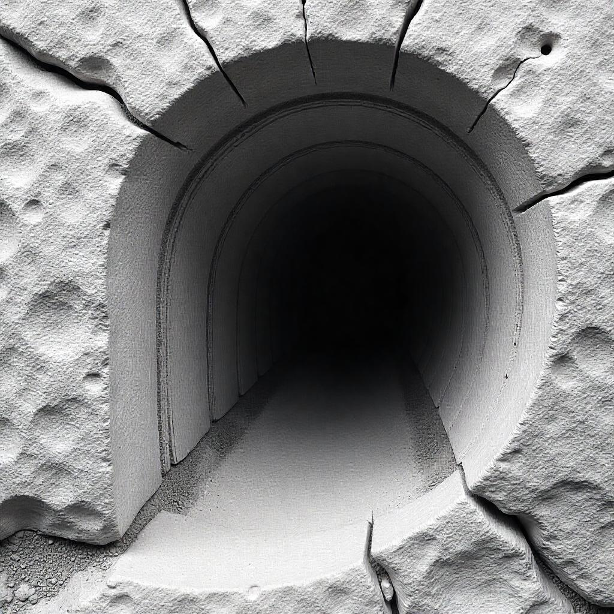

Chapter 3 - Dissecting the ELBO - Diffusion Models as Distribution-Transitioned Dynamics.

 

  

From previous chapters, we understand that our primary objective is to model the true underlying data distribution \\(p_{data}(x)\\) of the observed data \\(x\\). 
A successful model must assign high probability to the observed samples, ensuring that the learned distribution captures the essential characteristics of the data. 
However, designing such a model requires careful consideration of the underlying structure of the data distribution: we believe that with a structure closer to real situation (that we imagine), the better we have a good model. 

As established in Chapter 1, natural images—despite their high-dimensional pixel representation—typically reside on a low-dimensional manifold. 
This observation motivates the introduction of latent variables \\(z\\), which encode the intrinsic low-dimensional structure of the data (as discussed in Chapter 2). 
By incorporating such latent variables, we aim to build a model that better reflects the true generative process of natural images.
A well-structured model should generalize beyond the training data, avoiding the pitfall of overfitting. 
Without proper regularization or structural assumptions, the model could degenerate into a mixture of Dirac delta functions centered at the observed data points, i.e., \\(p(x) = \frac{1}{N}\sum^{N}_{i=1}\delta(x-x_i)\\). 
Such a solution, while achieving perfect training likelihood, fails to capture meaningful structure and generalizes poorly to unseen data.

We revisit our evidence:

$$\mathbb{E}_{q_\phi(z|x)}[\log \frac{p(z)p_\theta(x|z)}{q_\phi(z|x)}]$$

From Chapter 2, we came to know that  during the estimation of the evidence  \\(p(x)\\), the prior \\(p(z)\\) is playing important role there,  as the entire generative process begins with sampling from this distribution. 
This sampling operation is not merely a computational step, but rather a defining characteristic of modern generative models.
When using a trained model, each sample \\(z \sim p(z)\\) drawn from the latent space (typically encoded by the model's encoder component) generates a corresponding output \\(x = g_\theta(z)\\) through the decoder. 
The critical nature of sampling has driven significant developments in generative modeling, with most subsequent advances focusing on enhancing sampling efficiency, and improving the structure of the latent space.
Many modern model architectures prioritize these sampling-related capabilities, often at the expense of less critical properties. 

For the time being, as for the prior \\(p(z)\\), sampling from noise \\(z \sim \mathcal{N}(0, I)\\) gives diverse starting points for generation.
Even small perturbations in the noise direction create completely different images, amplifying diversity in generations.
It has to start with a simple distribution followed by transformation decided by parameters \\(\theta\\) where any complicate things can be stuffed in it.
Then we can manipulate \\(p(x)\\) with all the simple mathematical tricks through decoder \\(p_\theta(x|z)\\) and decoder \\(q_\phi(z|x)\\), as we have done in previous chapter that led us to deal with a more tractable objective for maximization, i.e. ELBO, rather than the \\(p(x)\\) itself.

Now, a critical question for now is: what should those encoder and decoder models be like?

We know that, to train any network, it requires supervised dataset. 
For either of the two networks, there is always one end that is missing data: the output for the encoder, and the input for the decoder.-- we just don't know what the latent is like in effect.

Or, how should we expect them be like?

Here comes the  _deus ex machina_ idea for this chapter： 

>Consider a stochastic process \\(x_t \in \mathbb{R}^d\\) evolving according to the Itô stochastic differential equation (SDE): $$
dx_t = \mu(x_t)dt + \sigma(x_t)dW_t
$$
where \\(W_t\\) is standard Brownian motion. 
The Fokker-Planck equation governs how the probability density \\(q(x,t)\\) evolves:

$$\frac{\partial q(x,t)}{\partial t} = -\nabla_x \cdot \big[\mu(x)q(x,t)\big] + \frac{1}{2}\nabla_x^2 \big[\sigma^2(x)q(x,t)\big]$$

with which we can set the prior to be the distribution convenient for us to sample, and we arrange the encoder/decoder to do the role the transition between the true data distribution and prior distribution.
This seems so magic! but let's have adequate faith in it because that is founded upon concrete mathematical deduction in the real of  Stochastic differential equation.

Before examining diffusion models, we first analyze GANs—a framework that transforms simple distributions into complex data distributions.
GANs achieve their objective by progressively morphing a basic latent distribution (e.g., Gaussian or uniform) into the target data distribution during sampling.
The generator network implements this through a parameterized nonlinear transformation, approximating the unknown target distribution.
This approach is theoretically supported by the Kolmogorov-Arnold representation theorem, which guarantees that any continuous multivariate function can be decomposed into univariate functions.
For high-dimensional spaces relevant to deep learning, the generator instantiates a practical realization of such hierarchical function composition, with each neural network layer implementing successive nonlinear transformations that collectively deform the input noise distribution.

Back to our case. 
We are now deploying Itô stochastic differential equation approach to transition the distribution, by first designing the SDE for target distribution, let's say  \\(p(x)\\).
Suppose we want the stationary distribution \\(q_{\text{stationary}}(x)\\) to be the \\(p(x)\\). 
Let's make an inspired choice by comparing: 

$$\begin{align}
\mu(x) &= \frac{1}{2}\nabla_x \log p(x) \\
\sigma(x) &= 1
\end{align}$$

Substituting into Fokker-Planck equation gives: 

$$\frac{\partial q(x,t)}{\partial t} = -\nabla_x \cdot \left[q(x,t) \frac{1}{2}\nabla_x \log p(x)\right] + \frac{1}{2}\nabla_x^2 q(x,t)$$

Here  \\(q(x, t)\\) is the density function of \\(x_t\\).
The equation induces a family of distributions \\(q(x, t)\\) describes where the stochastic process is likely to be at time \\(t\\).
Dissolve the derivative of logarithm, we have:

$$\frac{\partial q(x,t)}{\partial t} = -\nabla_x \cdot \left[q(x,t) \frac{1}{2}\frac{\nabla_x p(x)}{p(x)}\right] + \frac{1}{2}\nabla_x^2 q(x,t)$$

Since a stationary distribution \\(q_{stationary}(x)\\) satisfies

$$\frac{\partial q(x,t)}{\partial t} = 0$$

 for all \\(x\\), we set the time derivative to zero: 

$$0 = -\nabla_x \cdot \left[q_{stationary}(x) \frac{1}{2}\frac{\nabla_x p(x)}{p(x)}\right] + \frac{1}{2}\nabla_x^2 q_{stationary}(x)$$

The previous configuration of \\(\mu(x)\\) and \\(\sigma(x)\\) led us here where  \\(p(x)\\) is indeed the \\(q_{stationary}\\) , the stationary distribution of the \\(q(x,t)\\) distribution, albeit they are not the same in their initial phase.
To verify, we substitute \\(q_{stationary}(x) = p(x)\\) into this equation: $$\begin{align*}
0 &= -\nabla_x \cdot \left[p(x) \frac{1}{2}\frac{\nabla_x p(x)}{p(x)}\right] + \frac{1}{2}\nabla_x^2 p(x) \\
\implies 0 &= -\nabla_x \cdot \left[\frac{1}{2}\nabla_x p(x)\right] + \frac{1}{2}\nabla_x^2 p(x) \\
\implies 0 &= -\frac{1}{2}\nabla_x^2 p(x) + \frac{1}{2}\nabla_x^2 p(x) \\
\implies 0 &= 0
\end{align*}$$

Substitute \\(\mu(x)\\) and \\(\sigma(x)\\) again into the general Itô form:

$$dx_t = \underbrace{\frac{1}{2}\nabla_x \log p(x_t)}_{\text{Drift}}dt + \underbrace{dW_t}_{\text{Diffusion}}$$

This is called  the Langevin equation,  (one of) the soul(s) of diffusion model.
The drift term resembles pushing particles toward regions where  is larger.
The diffusion term obviously gives its name to the diffusion model. 

It appears that it is the \\(\nabla_x \log p(x_t)\\) in the drift term that guides the process toward the target distribution \\(p(x)\\) after getting the stationary distribution \\(q_{stationary}(x)\\).
For numerical implementation, choose step size \\(\epsilon \approx dt > 0\\) to discretize other terms in the Langevin equation: 

$$dx_t \approx \Delta x = x_{t+1} - x_t $$

We consider \\(dW_t\\) now.
For a small time step \\(\epsilon\\), the increment is defined in Wiener process to follow a normal distribution:
$$
W_{t+\epsilon} - W_t \sim \mathcal{N}(0, \epsilon).
$$
In the infinitesimal limit, this becomes:
$$
dW_t \sim \mathcal{N}(0, dt).
$$
We have:
$$
dW_t \approx \Delta W_t = W_{t+\epsilon} - W_t.
$$
Since \\(\Delta W_t \sim \mathcal{N}(0, \epsilon)\\), we can express it as:
$$
\Delta W_t = \sqrt{\epsilon} \, z_t, \quad z_t \sim \mathcal{N}(0, 1).
$$
Therefore,

$$\mathcal{N}(0,\Delta t) = \sqrt{\Delta t}\,\mathcal{N}(0,1)$$

Since:
$$
\Delta W_t \sim \mathcal{N}(0, \Delta t).
$$
the second moment (variance, since the mean is 0) is:
$$
\mathbb{E}[(\Delta W_t)^2] = \text{Var}(\Delta W_t) = \Delta t.
$$

We can now yield the Langevin update rule: 

$$x_{t+1} = x_t + \frac{\epsilon}{2}\nabla_x \log p(x_t) + \sqrt{\epsilon} z_t, \quad z_t \sim \mathcal{N}(0, \mathbf{I})$$

The Langevin dynamics equation is a fundamental technique for generating samples from distributions when we know their score function.
The original Langevin dynamics is deductive as the consequence of physics and mathematics. However, it does not harm to be seen as an empirical formula.

The diffusion model we're discussing around here is accomplished via distribution transition between gaussian distribution to and from true data distribution.
Now, what target distribution should \\(p(x)\\) be?

Let's take another look at the discretized Langevin equation

$$x_{t+1} = x_t + \frac{\epsilon_t}{2} \nabla_x \log p(x_t) + \sqrt{\epsilon_t} z_t, \quad z_t \sim \mathcal{N}(0, \mathbf{I}).$$

Over \\(T\\) steps, the cumulative transformation of \\(x_0\\) can be expressed as:

$$
x_T = x_0 + \sum_{t=0}^{T-1} \left( \frac{\epsilon_t}{2} \nabla_x \log p(x_t) \right) + \sum_{t=0}^{T-1} \sqrt{\epsilon_t} z_t.
$$

In the first term, \\(\sum_{t=0}^{T-1} \frac{\epsilon_t}{2} \nabla_x \log p(x_t)\\), if \\(\epsilon_t \to 0\\) sufficiently slowly, this term remains bounded but does not dominate the long-term behavior.
The second term, \\(\sum_{t=0}^{T-1} \sqrt{\epsilon_t} z_t\\), is a sum of independent, zero-mean Gaussian random variables with covariance \\(\sum_{t=0}^{T-1} \epsilon_t \mathbf{I}\\). 

Here's a second _deus ex machina_ in this chapter: the Central Limit Theorem -
> given a sufficiently large sample size \\(n\\), the sampling distribution of the mean of any independent, identically distributed (i.i.d.) random variables will approximate a normal distribution \\(\mathcal{N}(\mu, \sigma^2/n)\\), regardless of the original population's distribution. Formally, if \\(X_1, X_2, \dots, X_n\\) are i.i.d. with mean \\(\mu\\) and variance \\(\sigma^2\\), the sample mean $$\overline{X}_n = \frac{1}{n} \sum_{i=1}^n X_i$$ converges in distribution to a normal random variable:  
$$
\sqrt{n}(\bar{X}_n - \mu) \xrightarrow{d} \mathcal{N}(0, \sigma^2).
$$
It can be used to justify the ubiquity of the normal distribution in statistics, especially when the underlying data is non-normal.

By the Central Limit Theorem, in our Langevin equation, the  distribution of this sum will converge to a Gaussian.
And if \\(\epsilon_t\\) is chosen such that \\(\sum_{t=0}^{T-1} \epsilon_t\\) grows while  \\(\epsilon_t \to 0\\), then the  distribution of this sum will converge to  \\(\mathcal{N}(0, \sigma^2 \mathbf{I})\\), where \\(\sigma^2 = 2\sum_{t=0}^{T-1} \epsilon_t\\).
Thus, as \\(T \to \infty\\), the drift term's influence becomes negligible relative to the noise, and \\(x_T\\) behaves like a Gaussian random variable shifted by a finite drift. 
Properly normalizing \\(\epsilon_t\\) by ensuring \\(\sigma^2 = 1\\) leads to:
$$
x_T \approx \mathcal{N}(0, \mathbf{I}),
$$
which independent of the initial \\(x_0\\). 

This emerges naturally from the noise accumulation process, justifying the choice of a Gaussian as the terminal distribution for the reverse diffusion process. 
The Gaussian is not an arbitrary assumption, but the inevitable limiting distribution under the given SDE dynamics.
That's also why we didn't put the Gaussian prior as a _deux ex machina_ thing: we simply said that we wanted a distribution to sample to be of maximum entropy given fixed mean and variance (cf. Chapter 1).

Jubilation aside, how about we break it down in the context of Itô SDEs and the Fokker-Planck equation to see if uniform distribution is suitable for the job.
Uniform distribution is not closed under additive  noise.
Adding  noise (e.g. gaussian noise) to a uniform distribution also doesn't give another uniform distribution, because the process would quickly become non-uniform and less analytically tractable.
And, the score \\(\nabla_x \log p_t(x)\\) for uniform distributions is either undefined (flat probability density function between boundaries), or discontinuous (undefined at boundaries). 

The tractability of Gaussian distribution in generative models can be attributed to several properties.
Among its many remarkable properties, the stability under addition stands out. 
Let us consider two independent Gaussian random variables, \\(X \sim \mathcal{N}(\mu_X, \sigma_X^2)\\) and \\(Y \sim \mathcal{N}(\mu_Y, \sigma_Y^2)\\), with probability density functions (PDFs) given respectively by:

$$ f_X(x) = \frac{1}{\sqrt{2\pi \sigma_X^2}} \exp\left( -\frac{(x - \mu_X)^2}{2\sigma_X^2} \right), $$

and

$$ f_Y(y) = \frac{1}{\sqrt{2\pi \sigma_Y^2}} \exp\left( -\frac{(y - \mu_Y)^2}{2\sigma_Y^2} \right).$$

Our object of study is the sum \\(Z = X + Y\\), whose distribution we shall derive explicitly.
By the independence of \\(X\\) and \\(Y\\), the PDF of \\(Z\\) is given by the convolution of \\(f_X\\) and \\(f_Y\\):

$$
f_Z(z) = \int_{-\infty}^{\infty} f_X(x) f_Y(z - x) \, dx.
$$

Substituting the expressions for \\(f_X\\) and \\(f_Y\\), we obtain:

$$
f_Z(z) = \frac{1}{2\pi \sigma_X \sigma_Y} \int_{-\infty}^{\infty} \exp\left( -\frac{(x - \mu_X)^2}{2\sigma_X^2} - \frac{(z - x - \mu_Y)^2}{2\sigma_Y^2} \right) \, dx.
$$

The crux of the proof lies in the simplification of the exponent. 
Let's denote the argument of the exponential as:

$$
E(x) = \frac{(x - \mu_X)^2}{2\sigma_X^2} + \frac{(z - x - \mu_Y)^2}{2\sigma_Y^2}.
$$

Our task is to express \\(E(x)\\) in the form \\(A(x - B)^2 + C\\), where \\(A, B\\) and \\(C\\) are quantities independent of \\(x\\).
Expanding the squares, we have:

$$
E(x) = \frac{(x^2 - 2\mu_X x + \mu_X^2)}{2\sigma_X^2} + \frac{(x^2 - 2x(z - \mu_Y) + (z - \mu_Y)^2)}{2\sigma_Y^2}.
$$

Collecting like terms in \\(x\\), we rewrite \\(E(x)\\) as:

$$
E(x) = \left( \frac{1}{2\sigma_X^2} + \frac{1}{2\sigma_Y^2} \right) x^2 - \left( \frac{\mu_X}{\sigma_X^2} + \frac{z - \mu_Y}{\sigma_Y^2} \right) x + \left( \frac{\mu_X^2}{2\sigma_X^2} + \frac{(z - \mu_Y)^2}{2\sigma_Y^2} \right).
$$

Define:

$$
\alpha = \frac{1}{\sigma_X^2} + \frac{1}{\sigma_Y^2}, \quad \beta = \frac{\mu_X}{\sigma_X^2} + \frac{z - \mu_Y}{\sigma_Y^2}, \quad \gamma = \frac{\mu_X^2}{2\sigma_X^2} + \frac{(z - \mu_Y)^2}{2\sigma_Y^2}.
$$

Then, \\(E(x)\\) may be expressed as:

$$
E(x) = \frac{\alpha}{2} x^2 - \beta x + \gamma.
$$

Completing the square in \\(x\\), we write:

$$
E(x) = \frac{\alpha}{2} \left( x^2 - \frac{2\beta}{\alpha} x \right) + \gamma = \frac{\alpha}{2} \left( x - \frac{\beta}{\alpha} \right)^2 - \frac{\beta^2}{2\alpha} + \gamma.
$$

Thus, the exponent decomposes into a perfect square in \\(x\\) and a residual term independent of \\(x\\).
Substituting this back into the expression for \\(f_Z(z)\\), we have:

$$
f_Z(z) = \frac{1}{2\pi \sigma_X \sigma_Y} \exp\left( -\frac{\beta^2}{2\alpha} + \gamma \right) \int_{-\infty}^{\infty} \exp\left( -\frac{\alpha}{2} \left( x - \frac{\beta}{\alpha} \right)^2 \right) \, dx.
$$

The integral is now recognizable as the integral of a Gaussian function. 
Specifically,

$$
\int_{-\infty}^{\infty} \exp\left( -\frac{\alpha}{2} \left( x - \frac{\beta}{\alpha} \right)^2 \right) \, dx = \sqrt{\frac{2\pi}{\alpha}},
$$

since the integrand is proportional to the PDF of a normal distribution with mean \\(\frac{\beta}{\alpha}\\) and variance \\(\frac{1}{\alpha}\\).
Thus,

$$
f_Z(z) = \frac{1}{2\pi \sigma_X \sigma_Y} \sqrt{\frac{2\pi}{\alpha}} \exp\left( -\frac{\beta^2}{2\alpha} + \gamma \right).
$$

We now turn our attention to the exponent \\(-\frac{\beta^2}{2\alpha} + \gamma\\). Substituting back the definitions of \\(\alpha, \beta\\) and \\(\gamma\\), we have:

$$
-\frac{\beta^2}{2\alpha} + \gamma = -\frac{1}{2\alpha} \left( \frac{\mu_X}{\sigma_X^2} + \frac{z - \mu_Y}{\sigma_Y^2} \right)^2 + \frac{\mu_X^2}{2\sigma_X^2} + \frac{(z - \mu_Y)^2}{2\sigma_Y^2}.
$$

This expression, though cumbersome, may be simplified by algebraic manipulation. Let us denote \\(\sigma_Z^2 = \sigma_X^2 + \sigma_Y^2\\), and observe that \\(\alpha = \frac{\sigma_Z^2}{\sigma_X^2 \sigma_Y^2}\\). 
Then,

$$
-\frac{\beta^2}{2\alpha} + \gamma = -\frac{\sigma_X^2 \sigma_Y^2}{2\sigma_Z^2} \left( \frac{\mu_X \sigma_Y^2 + (z - \mu_Y)\sigma_X^2}{\sigma_X^2 \sigma_Y^2} \right)^2 + \frac{\mu_X^2 \sigma_Y^2 + (z - \mu_Y)^2 \sigma_X^2}{2\sigma_X^2 \sigma_Y^2}.
$$

Simplifying, we find:

$$
-\frac{\beta^2}{2\alpha} + \gamma = -\frac{(\mu_X \sigma_Y^2 + (z - \mu_Y)\sigma_X^2)^2}{2\sigma_X^2 \sigma_Y^2 \sigma_Z^2} + \frac{\mu_X^2 \sigma_Y^2 + (z - \mu_Y)^2 \sigma_X^2}{2\sigma_X^2 \sigma_Y^2}.
$$

Factoring the numerator of the first term, we obtain:

$$
\mu_X^2 \sigma_Y^4 + 2\mu_X (z - \mu_Y) \sigma_X^2 \sigma_Y^2 + (z - \mu_Y)^2 \sigma_X^4.
$$

Thus,

$$
-\frac{\beta^2}{2\alpha} + \gamma = \frac{-( \mu_X^2 \sigma_Y^4 + 2\mu_X (z - \mu_Y) \sigma_X^2 \sigma_Y^2 + (z - \mu_Y)^2 \sigma_X^4 ) + \mu_X^2 \sigma_Y^2 \sigma_Z^2 + (z - \mu_Y)^2 \sigma_X^2 \sigma_Z^2}{2\sigma_X^2 \sigma_Y^2 \sigma_Z^2}.
$$

Substituting \\(\sigma_Z^2 = \sigma_X^2 + \sigma_Y^2\\), the expression reduces, after cancellation, to:

$$
-\frac{(z - (\mu_X + \mu_Y))^2}{2\sigma_Z^2}.
$$

Thus, the PDF of \\(Z\\) simplifies to:

$$
f_Z(z) = \frac{1}{2\pi \sigma_X \sigma_Y} \sqrt{\frac{2\pi \sigma_X^2 \sigma_Y^2}{\sigma_Z^2}} \exp\left( -\frac{(z - (\mu_X + \mu_Y))^2}{2\sigma_Z^2} \right).
$$

Further simplification yields:

$$
f_Z(z) = \frac{1}{\sqrt{2\pi \sigma_Z^2}} \exp\left( -\frac{(z - (\mu_X + \mu_Y))^2}{2\sigma_Z^2} \right).
$$

This is precisely the PDF of a Gaussian random variable \\(Z \sim \mathcal{N}(\mu_X + \mu_Y, \sigma_X^2 + \sigma_Y^2)\\).

We have thus demonstrated, through direct computation of the convolution integral, that the sum of two independent Gaussian random variables is itself Gaussian, with mean and variance given by the sums of the respective means and variances. 
Similarly, it is not hard to imagine that if \\(X \sim \mathcal{N}(\mu, \sigma^2)\\), then scaling by a constant \\(a\\) yields another Gaussian:

$$ aX \sim \mathcal{N}(a\mu, a^2\sigma^2).$$

Combining the addivity properties, let \\(X_1, X_2, \dots, X_n\\) be independent Gaussian random variables, where \\(X_i \sim \mathcal{N}(\mu_i, \sigma_i^2)\\), and let \\(a_1, a_2, \dots, a_n\\) be arbitrary constants. 
Then, the linear combination:

$$ Y = a_1 X_1 + a_2 X_2 + \dots + a_n X_n $$

is still Gaussian, with mean and variance:

$$
Y \sim \mathcal{N}\left( \sum_{i=1}^n a_i \mu_i, \sum_{i=1}^n a_i^2 \sigma_i^2 \right).
$$

which is the linearity of gaussian distribution.

There are another two important features of Gaussian distribution.
First, in Bayesian inference, if the prior and likelihood are Gaussian, the posterior is also Gaussian.
We can see that by using Bayesian : 

$$ p(\theta | x) \propto p(x | \theta) \times p(\theta).$$

in substituting the expressions for the likelihood and the prior: 

$$p(\theta | x) \propto \frac{1}{\sqrt{2\pi\sigma^2}} \exp \left( -\frac{(x-\theta)^2}{2\sigma^2} \right) \times \frac{1}{\sqrt{2\pi\sigma_0^2}} \exp \left( -\frac{(\theta-\mu_0)^2}{2\sigma_0^2} \right) $$

Combining the constants and the exponents, we thus have: 

$$p(\theta | x) \propto \exp \left( -\frac{(x-\theta)^2}{2\sigma^2} - \frac{(\theta-\mu_0)^2}{2\sigma_0^2} \right) $$

Second, the Gaussian PDF is infinitely differentiable, making it suitable for gradient-based optimization (e.g., the backpropagation in neural networks).
For \\(X \sim \mathcal{N}(\mu, \sigma^2)\\), the PDF is: 

$$ f(x) = \frac{1}{\sigma \sqrt{2\pi}} e^{-\frac{(x-\mu)^2}{2\sigma^2}} $$

The function \\(f(x)\\) consists of a polynomial term \\((x-\mu)\\) (infinitely differentiable) and an exponential term \\(e^{-g(x)}\\) where \\(g(x) = \frac{(x-\mu)^2}{2\sigma^2}\\) (infinitely differentiable).
By the chain rule, the \\(n\\)-th derivative exists for all \\(n \in \mathbb{N}\\): 

$$ f^{(n)}(x) = \frac{d^n}{dx^n} \left[ \frac{1}{\sigma \sqrt{2\pi}} e^{-\frac{(x-\mu)^2}{2\sigma^2}} \right] $$

This yields a product of polynomials in \\((x-\mu)\\) with the original exponential that is always preserved. 

We reiterate the soul equation of Langevin dynamics here: 

$$x_{t+1} = x_t + \frac{\epsilon}{2}\nabla_x \log p(x_t) + \sqrt{\epsilon} z_t$$

We check this in the background of sampling/noising  via distribution transition perspective.
The equation describes a discrete-time stochastic process where \\(x_{t+1}\\) is obtained from \\(x_t\\)by taking a small step in the direction of the gradient of the log-probability \\(\nabla_x \log p(x_t)\\), scaled by a step size \\(\epsilon/2\\), and perturbed by Gaussian noise \\(\sqrt{\epsilon} z_t\\), where \\(z_t \sim \mathcal{N}(0, I)\\).  

Langevin dynamics where the drift term is zero, and only the noise term contributes, leading to a pure diffusion process: it simply adds noise, and data is gradually corrupted by noise over a sequence of time steps toward the Gaussian.  

Conversely, using  \\(\nabla_x \log p(x_t)\\)—the gradient of the log-probability of the data at each noise level, the equation can be guided with the direction in which the probability density increases most steeply, effectively "pulling" samples back toward the true data distribution.  

The *time step* \\(t\\) plays a crucial role in diffusion models, as the amount of noise added or removed varies with time. 
Typically, the noise schedule can be designed such that early steps introduce large noise (coarse structure), while later steps refine finer details. 
The step size \\(\epsilon\\) controls the trade-off between the deterministic drift  and the stochastic noise component.  

Thus, the Langevin equation provides a principled way to understand how iterative noise addition and denoising,  enable the generation of complex data distributions from simple noise. 

Each denoising step must consider directional accuracy, because directions matter more than norms in high-dim spaces (since everything has similar norm). 
The *direction of the noise vector* and how it's removed is critical.
The model’s job is to steer the vector toward the data manifold, starting from nearly orthogonal directions.
The quantity in question is  the gradient of the log of _true density_ of data, w.r.t the data variable, which is now referred to as score: 

$$\nabla_x\log q_{data}(x)\triangleq s(x).$$

In this spirit, now we take another look at the tensors in the high-dimensional space that locates  the  gaussian as our target prior distribution therein: how are they correlated in terms of direction?
Let \\(\mathbf{X} \in \mathbb{R}^d\\) be a random vector with i.i.d. entries \\(X_i \sim \mathcal{N}(0, 1)\\). 
Then  \\(\mathbf{X} \sim \mathcal{N}(0, I_d)\\), and the Euclidean norm $$\|\mathbf{X}\|_2 ^2 = \sum_{i=1}^d X_i^2 \sim \chi^2 (d)$$ by definition.
As \\(d \to \infty\\), the norm concentrates \\(\|\mathbf{X}\|_2 \approx \sqrt{d}\\) with high probability, as we have discussed in Chapter 1.
We are now checking the distribution of \\(\mathbf{X}/\|\mathbf{X}\|_2\\) , i.e. the directional unit vectors.

We start  considering an orthogonal matrix \\(Q\in O(d)\\). 
An orthogonal matrix satisfies \\(Q^TQ=QQ^T=I_d\\)​. 
It preserves lengths and angles. 
When we apply \\(Q\\) to \\(\mathbf{X}\\), the transformed vector \\(Q\mathbf{X}\\) is also normally distributed because we have proved above that linear transformations of Gaussians remain Gaussian. 
Specifically, for any linear transformation \\(A\\), \\(A\mathbf{X}\sim \mathcal{N}(A\mu,A\Sigma A^T)\\). 
Here, \\(X\\) has mean 0 and covariance \\(I_d\\)​, so \\(QX\\) has mean \\(Q⋅0=0\\) and covariance \\(QI_d​Q^T=QQ^T=I_d\\)​. 
Thus, \\(Q\mathbf{X}\sim \mathcal{N}(0,I_d)\\), proving invariance under orthogonal transformations, i.e.  

$$Q \mathbf{X} \sim \mathbf{X} \quad \text{for any } Q \in O(d)j.$$

This implies that \\(Q\\) preserves lengths (i.e., \\(\|Q\mathbf{x}\| = \|\mathbf{x}\|\\)) and angles in rotations and reflections in \\(d\\)-dimensional space.
Thus, the direction \\(\mathbf{U} = \mathbf{X}/\|\mathbf{X}\|_2\\) must be rotationally invariant on the sphere (rotation is one type of orthogonal transformation), which implies: 

$$\mathbf{U} \sim \text{Unif}(S^{d-1}),$$

where \\(\text{Unif}\\) means uniform distribution.
This is because if a distribution is rotationally invariant, then the probability measure doesn’t prefer any direction, i.e., all directions must be equally likely, due to \\(Q \mathbf{X} \sim \mathbf{X}\\).
With high probability,  any two independent samples in high dimensions lie nearly orthogonal, which means the angle between two random vectors on \\(S^{d-1}\\) tends toward \\(\pi/2\\) as \\(d \to \infty\\).

Let's thus calculate the inner product of  any two directions.
For \\(\mathbf{u}, \mathbf{v} \sim \text{Unif}(S^{d-1})\\), we can have:
 

$$\mathbf{u} = \frac{\mathbf{x}}{\|\mathbf{x}\|_2}, \quad \mathbf{v} = \frac{\mathbf{y}}{\|\mathbf{y}\|_2},$$

where \\(\mathbf{x}, \mathbf{y} \sim \mathcal{N}(0, I_d)\\) i.i.d. with  each component \\(x_i, y_i \sim \mathcal{N}(0, 1)\\) i.i.d., and 

$$\langle \mathbf{u}, \mathbf{v} \rangle = \frac{\langle \mathbf{x}, \mathbf{y} \rangle}{\|\mathbf{x}\|\|\mathbf{y}\|}.$$

Then consider: 

$$ \langle \mathbf{x}, \mathbf{y} \rangle = \sum_{i=1}^d x_i y_i $$

as a sum of \\(d\\) i.i.d. mean-0, variance-1 random variables.
Since \\(\mathbf{x}\\) and \\(\mathbf{y}\\) are independent: 

$$\mathbb{E}[\langle \mathbf{x}, \mathbf{y} \rangle] = \mathbb{E}\left[\sum_{i=1}^d x_i y_i\right] = \sum_{i=1}^d \mathbb{E}[x_i y_i] = \sum_{i=1}^d \mathbb{E}[x_i]\mathbb{E}[y_i] = \sum_{i=1}^d 0 \cdot 0 = 0$$

Again using independence: 

$$\text{Var}[\langle \mathbf{x}, \mathbf{y} \rangle] = \text{Var}\left[\sum_{i=1}^d x_i y_i\right] = \sum_{i=1}^d \text{Var}[x_i y_i]$$

For each term \\(x_i y_i\\) where \\(x_i, y_i\\) are independent standard normal: 

$$\text{Var}[x_i y_i] = \mathbb{E}[x_i^2 y_i^2] - (\mathbb{E}[x_i y_i])^2 = \mathbb{E}[x_i^2]\mathbb{E}[y_i^2] - 0 = 1 \cdot 1 = 1$$

Therefore: 

$$\text{Var}[\langle \mathbf{x}, \mathbf{y} \rangle] = \sum_{i=1}^d 1 = d$$

Since each \\(x_i y_i\\) is a product of independent normal random variables, and we're summing \\(d\\) such terms, the sum converges to a normal distribution. 
In this way, we have: 

$$\langle \mathbf{x}, \mathbf{y} \rangle \sim \mathcal{N}(0, d)$$

Using concentration bounds that we already know, we have:

$$\frac{\|\mathbf{x}\|}{\sqrt{d}} \xrightarrow{P} 1, \frac{\|\mathbf{y}\|}{\sqrt{d}} \xrightarrow{P} 1$$

Now combine everything: 

$$\langle \mathbf{u}, \mathbf{v} \rangle = \frac{\langle \mathbf{x}, \mathbf{y} \rangle}{\|\mathbf{x}\| \|\mathbf{y}\|} 
\approx \frac{\mathcal{N}(0, d)}{\sqrt{d} \cdot \sqrt{d}} 
= \mathcal{N}\left(0, \frac{1}{d} \right)$$

Hence: 

$$\langle \mathbf{u}, \mathbf{v} \rangle \xrightarrow{P} 0 \quad \text{as } d \to \infty$$

The cosine of the angle between two random unit vectors converges in probability to 0, i.e.: 

$$\theta(\mathbf{u}, \mathbf{v}) \xrightarrow{P} \frac{\pi}{2}$$

 

With so much illustration on the SDE data distribution transition on how to transform  an unknown distribution into normal distribution.
What about the reverse one?

We start by  Itô stochastic differential equation (SDE) 

$$
dx_t = \mu(x_t)dt + \sigma(x_t)dW_t
$$

again.
We can now easily have: 

$$\mathbf{x}_{t+\varepsilon} \approx \mathbf{x}_t + \mathbf{\mu}(\mathbf{x}_t, t)\varepsilon + \sigma(t)\sqrt{\varepsilon} \cdot \boldsymbol{z},\quad \text{where }z\sim \mathcal{N}(0,I).$$

So, in perspective of conditional probability, the transition density is approximately:

$$p(\mathbf{x}_{t+\varepsilon} \mid \mathbf{x}_t) = \mathcal{N}(\mathbf{x}_{t+\varepsilon};\, \mathbf{x}_t + \mathbf{\mu}(\mathbf{x}_t, t)\varepsilon,\, \sigma^2(t)\varepsilon \mathbf{I})$$

Now filp time, by going from \\(\mathbf{x}_{t+\varepsilon}\\) back to \\(\mathbf{x}_t\\).
Using Bayes' rule:

$$
p(\mathbf{x}_t \mid \mathbf{x}_{t+\varepsilon}) \propto p(\mathbf{x}_{t+\varepsilon} \mid \mathbf{x}_t) \cdot p_t(\mathbf{x}_t)
$$

The reverse-time drift should move us back toward areas of high probability, weighted by how likely it was to get there in the forward step.

The transition density \\(p(\mathbf{x}_{t+\varepsilon} \mid \mathbf{x}_t)\\) can be perceived as  a Gaussian centered at \\(\mathbf{x}_t + \mathbf{\mu}(\mathbf{x}_t, t)\varepsilon\\) with covariance \\(\sigma^2(t)\varepsilon \mathbf{I}\\):

$$
p(\mathbf{x}_{t+\varepsilon} \mid \mathbf{x}_t) \propto \exp\left(-\frac{\|\mathbf{x}_{t+\varepsilon} - \mathbf{x}_t - \mathbf{\mu}(\mathbf{x}_t, t)\varepsilon\|^2}{2\sigma^2(t)\varepsilon}\right).
$$

Taking the logarithm (ignoring normalization constants):

$$
\log p(\mathbf{x}_{t+\varepsilon} \mid \mathbf{x}_t) = -\frac{\|\mathbf{x}_{t+\varepsilon} - \mathbf{x}_t - \mathbf{\mu}(\mathbf{x}_t, t)\varepsilon\|^2}{2\sigma^2(t)\varepsilon} + \text{const}.
$$

Using Bayes' rule, the reverse conditional density is:

$$
\log p(\mathbf{x}_t \mid \mathbf{x}_{t+\varepsilon}) = \log p(\mathbf{x}_{t+\varepsilon} \mid \mathbf{x}_t) + \log p_t(\mathbf{x}_t) - \log p_{t+\varepsilon}(\mathbf{x}_{t+\varepsilon}).
$$
For small \\(\varepsilon\\), we approximate 

$$\log p_{t+\varepsilon}(\mathbf{x}_{t+\varepsilon}) \approx \log p_t(\mathbf{x}_{t+\varepsilon})$$

since the density evolves slowly, giving:

$$
\log p(\mathbf{x}_t \mid \mathbf{x}_{t+\varepsilon}) = \log p(\mathbf{x}_{t+\varepsilon} \mid \mathbf{x}_t) + \log p_t(\mathbf{x}_t) - \log p_t(\mathbf{x}_{t+\varepsilon}) + \text{const}.
$$

Substituting the Gaussian transition density:

$$
\log p(\mathbf{x}_t \mid \mathbf{x}_{t+\varepsilon}) = -\frac{\|\mathbf{x}_{t+\varepsilon} - \mathbf{x}_t - \mathbf{\mu}(\mathbf{x}_t, t)\varepsilon\|^2}{2\sigma^2(t)\varepsilon} + \log p_t(\mathbf{x}_t) - \log p_t(\mathbf{x}_{t+\varepsilon}) + \text{const}.
$$

For small \\(\varepsilon\\), $$\mathbf{x}_t$$ is close to $$\mathbf{x}_{t+\varepsilon}$$, so we Taylor expand $$\log p_t(\mathbf{x}_t)$$ around $$\mathbf{x}_{t+\varepsilon}$$:

$$
\log p_t(\mathbf{x}_t) \approx \log p_t(\mathbf{x}_{t+\varepsilon}) + \nabla \log p_t(\mathbf{x}_{t+\varepsilon})^T (\mathbf{x}_t - \mathbf{x}_{t+\varepsilon}) + \mathcal{O}(\|\mathbf{x}_t - \mathbf{x}_{t+\varepsilon}\|^2).
$$

Substituting this back:

$$
\log p(\mathbf{x}_t \mid \mathbf{x}_{t+\varepsilon}) \approx -\frac{\|\mathbf{x}_{t+\varepsilon} - \mathbf{x}_t - \mathbf{\mu}(\mathbf{x}_t, t)\varepsilon\|^2}{2\sigma^2(t)\varepsilon} + \nabla \log p_t(\mathbf{x}_{t+\varepsilon})^T (\mathbf{x}_t - \mathbf{x}_{t+\varepsilon}) + \text{const}.
$$

We approximate 

$$\mathbf{\mu}(\mathbf{x}_t, t) \approx \mathbf{\mu}(\mathbf{x}_{t+\varepsilon}, t)$$

and rewrite:

$$
\log p(\mathbf{x}_t \mid \mathbf{x}_{t+\varepsilon}) \approx -\frac{\|\mathbf{x}_{t+\varepsilon} - \mathbf{x}_t - \mathbf{\mu}(\mathbf{x}_{t+\varepsilon}, t)\varepsilon\|^2}{2\sigma^2(t)\varepsilon} + \nabla \log p_t(\mathbf{x}_{t+\varepsilon})^T (\mathbf{x}_t - \mathbf{x}_{t+\varepsilon}) + \text{const}.
$$

Let 

$$\mathbf{z} = \mathbf{x}_t - \mathbf{x}_{t+\varepsilon} + \mathbf{\mu}(\mathbf{x}_{t+\varepsilon}, t)\varepsilon,$$

so the right-hand side is:

$$
-\frac{\|\mathbf{z}\|^2}{2\sigma^2(t)\varepsilon} + \nabla \log p_t(\mathbf{x}_{t+\varepsilon})^T \mathbf{z} + \nabla \log p_t(\mathbf{x}_{t+\varepsilon})^T \mathbf{\mu(x_{t+\epsilon},t)\epsilon} .
$$

where 

$$\nabla \log p_t(\mathbf{x}_{t+\varepsilon})^T \mathbf{\mu(x_{t+\epsilon},t)\epsilon}$$

can be absorbed into constant.
Then, make a  square in form of something like \\((z - a)^2\\):

$$ -\frac{\|\mathbf{z}\|^2}{2\sigma^2(t)\varepsilon} + \nabla \log p_t(\mathbf{x}_{t+\varepsilon})^T \mathbf{z} = -\frac{1}{2\sigma^2(t)\varepsilon} \left( \|\mathbf{z} - \sigma^2(t)\varepsilon \nabla \log p_t(\mathbf{x}_{t+\varepsilon})\|^2 - \sigma^4(t)\varepsilon^2 \|\nabla \log p_t(\mathbf{x}_{t+\varepsilon})\|^2 \right). $$

The completed-square term is:

$$
\|\mathbf{z} - \sigma^2(t)\varepsilon \nabla \log p_t(\mathbf{x}_{t+\varepsilon})\|^2.
$$

Recall that \\(\mathbf{z}\\) is defined as:

$$
\mathbf{z} = \mathbf{x}_{t+\varepsilon} - \mathbf{x}_t - \mathbf{\mu}(\mathbf{x}_{t+\varepsilon}, t)\varepsilon.
$$

Substitute \\(\mathbf{z}\\) back into the squared term:

$$
\|\mathbf{x}_{t+\varepsilon} - \mathbf{x}_t - \mathbf{\mu}(\mathbf{x}_{t+\varepsilon}, t)\varepsilon - \sigma^2(t)\varepsilon \nabla \log p_t(\mathbf{x}_{t+\varepsilon})\|^2.
$$

This can be rewritten as:

$$ \|\mathbf{x}_t - (\mathbf{x}_{t+\varepsilon} - \mathbf{\mu}(\mathbf{x}_{t+\varepsilon}, t)\varepsilon + \sigma^2(t)\varepsilon \nabla \log p_t(\mathbf{x}_{t+\varepsilon}))\|^2. $$

Now, plug this back into the original expression:

$$
-\frac{1}{2\sigma^2(t)\varepsilon} \left( \|\mathbf{x}_t - (\mathbf{x}_{t+\varepsilon} - \mathbf{\mu}(\mathbf{x}_{t+\varepsilon}, t)\varepsilon + \sigma^2(t)\varepsilon \nabla \log p_t(\mathbf{x}_{t+\varepsilon}))\|^2 - \sigma^4(t)\varepsilon^2 \|\nabla \log p_t(\mathbf{x}_{t+\varepsilon})\|^2 \right).
$$

Considering \\(\epsilon \rightarrow 0\\) , we can write:

$$
-\frac{\|\mathbf{x}_t - (\mathbf{x}_{t+\varepsilon} - \mathbf{\mu}(\mathbf{x}_{t+\varepsilon}, t)\varepsilon + \sigma^2(t)\varepsilon \nabla \log p_t(\mathbf{x}_{t+\varepsilon}))\|^2}{2\sigma^2(t)\varepsilon}
$$

This is the exponential part of the Gaussian $$p(\mathbf{x}_t \mid \mathbf{x}_{t+\varepsilon})$$.
So its mean of the Gaussian is:

$$
\mathbf{x}_{t+\varepsilon} - \mathbf{\mu}(\mathbf{x}_{t+\varepsilon}, t)\varepsilon + \sigma^2(t)\varepsilon \nabla \log p_t(\mathbf{x}_{t+\varepsilon}).
$$

The dominant term is:

$$
\log p(\mathbf{x}_t \mid \mathbf{x}_{t+\varepsilon}) \approx -\frac{\|\mathbf{x}_t - (\mathbf{x}_{t+\varepsilon} + \mathbf{\mu}(\mathbf{x}_{t+\varepsilon}, t)\varepsilon - \sigma^2(t)\varepsilon \nabla \log p_t(\mathbf{x}_{t+\varepsilon}))\|^2}{2\sigma^2(t)\varepsilon} + \text{const}.
$$

Thus, the conditional mean of $$\mathbf{x}_t$$ given $$\mathbf{x}_{t+\varepsilon}$$ is:

$$
\mathbf{x}_t \approx \mathbf{x}_{t+\varepsilon} - \mathbf{\mu}(\mathbf{x}_{t+\varepsilon}, t)\varepsilon + \sigma^2(t)\varepsilon \nabla \log p_t(\mathbf{x}_{t+\varepsilon}).
$$

The reverse drift is: 

$$ \tilde{\mathbf{\mu}}(\mathbf{x}, t) = \mathbf{\mu}(\mathbf{x}, t) - \sigma(t)^2 \nabla_{\mathbf{x}} \log p_t(\mathbf{x})$$

Hence,

$$
d\mathbf{x} = \left[ \mathbf{\mu}(\mathbf{x}, t) - \sigma(t)^2 \nabla_{\mathbf{x}} \log p_t(\mathbf{x}) \right] dt + \sigma(t) d\bar{\mathbf{w}}_t
$$

Considering the definition of  mean and that of expectation, we sometimes confront situation with \\(\mu(\mathbf{x},t)=0\\)
we can also have:

$$
\mathbb{E}[x_t \mid x_{t+\epsilon}] = x_{t+\epsilon} + \sigma(t)^2 \nabla_{x_t} \log p(x_t)
$$

Here the plus before \\(\sigma(t)\\) is a denotation custom.
This is Tweedie's formula, a powerful, popular and elegant formula in community.

If we refer to the formula of transforming unknown true data distribution to normal gaussian as noise adding, and the formula of reverse process as denoising, then the Tweedie's formula beautifully shows optimal denoising (what we want) on the left side, and what we can compute (i.e. current position + score-based movement) on the right.
It is noted that the situation of  \\(\mu(\mathbf{x},t)=0\\) is a typical common practice for the community to add noise.
Simply, at a point \\(x\\), it tell us the best direction to step into (with little step-size \\(\delta\\)) if we would like to see a point \\(x'\\) with slightly higher likelihood

$$
x' = x + \delta \cdot \nabla_x \log q_{data}(x) \big|_{x=x}
$$

This is quite easy to imagine as this is a simple geometric description.
But now, we will see that for a noisy observation \\(x_t\\), the optimal denoising direction is: 

$$\mathbb{E}[x_0 | x_t] - x_t = \sigma_t^2 \cdot \nabla_{x_t} \log p(x_t)$$

which shows that denoising optimally is equivalent to moving in the score direction.

This is the mathematical miracle that makes diffusion models possible: a simple regression loss secretly teaches the network to estimate probability gradients, which is exactly what we need for sampling from complex distributions.
The best Bayesian denoiser (in expectation) of the noisy input is given by the input plus a term involving the score function of the noisy marginal.
In essence, instead of directly maximizing \\(\log p_{true}(x_{observed})\\) (which requires computing normalization constants), we can learn the geometry of the probability landscape through its gradients. 

Now, we are so glad to see ourselves capable of transitioning from an. unknown true data distribution, towards a general normal Gaussian,  and retrieve it back. 
That's exactly how we manipulate the observed data as machine learning training materials!
Now that we have at hand a bunch of true images as dataset. 
Is it enough for us to start the training in diffusion model by comparing pixelwise difference from input and output images?
Yes, but remember our goal is to maximize the data distribution.
So we still need to go through one last block of the diffusion model theory --- the loss function.

By definition, the loss function should be  

$$
L_{\text{KL}} = \mathbb{E}_{z \sim q_{data}}\left[ \log q_{data}(x) - \log p_\theta(x)   \right].
$$

However, since the distribution transition invovles mainly the score, we would like to express the loss function in terms of score.
An intuitive loss function would therefore be like

$$\mathcal{L}_{score} = \mathbb{E}_{x\sim q_{data}}\left[\left|\nabla_x \log p_\theta(x) - \nabla_x \log q_{data}(x)\right|^2\right]$$

i.e. an observation-weighted divergence of minimization aiming to match the gradients of the log-densities.
Now we give it a more robust analysis.

Let's consider a parametric family of distributions \\(p_\epsilon(x) = p(x)(1 + \epsilon h(x))\\) that represents a small perturbation from \\(p(x)\\), where \\(h(x)\\) is a function with $$\mathbb{E}_p[h(x)] = 0$$ to ensure normalization.
The perturbation as a technique is a popular way to bring gradient sort-of-thing onto the stage.
The KL divergence between \\(p(x)\\) and \\(p_\epsilon(x)\\) is:

$$KL(p||p_\epsilon) = \mathbb{E}_p\left[\log \frac{p(x)}{p(x)(1 + \epsilon h(x))}\right] = \mathbb{E}_p[-\log(1 + \epsilon h(x))]$$

Using Taylor expansion for small \\(\epsilon\\): 

$$-\log(1 + \epsilon h(x)) \approx -\epsilon h(x) + \frac{\epsilon^2 h(x)^2}{2} + O(\epsilon^3)$$

So: 

$$KL(p||p_\epsilon) \approx -\epsilon \mathbb{E}_p[h(x)] + \frac{\epsilon^2}{2}\mathbb{E}_p[h(x)^2] + O(\epsilon^3)$$

Since \\(\mathbb{E}_p[h(x)] = 0\\) by construction: 

$$KL(p||p_\epsilon) \approx \frac{\epsilon^2}{2}\mathbb{E}_p[h(x)^2] + O(\epsilon^3)$$

Now, for score-based perturbations, we can express \\(h(x)\\) in terms of the score function. 
When \\(p_\epsilon\\) differs from \\(p\\) by a small change in the score function, it can be shown that:

$$KL(p||p_\epsilon) \approx \frac{\epsilon^2}{2}\mathbb{E}_p[||\nabla_x \log p(x) - \nabla_x \log p_\epsilon(x)||^2] + O(\epsilon^3)$$

The term inside the expectation is precisely the \\(L_{\text{score}}\\) divergence, which is called  Fisher divergence in the community. 
Fisher divergence can be seen as a first-order Taylor approximation to the KL divergence in the space of probability distributions, making it especially useful when exact likelihood is intractable.
In the above, by admitting that the KL divergence is measuring the loss between a model and the true data distribution, we proved the equivalence of  Fisher divergence  with KL divergence.

There is another proof illustrating that Fisher divergence itself is geared towards the finding of the true distribution from a model.
Assume the score \\(s_{\theta}(x) = \nabla_x \log p_{\theta}(x)\\) is the gradient of the log-likelihood.  
Starting from

$$J_{SM}(\theta) = \mathbb{E}_{x \sim q_{data}(x)} \left[ \frac{1}{2} |s_\theta(x) - \nabla_x \log q_{data}(x)|^2 \right]$$

The squared norm can be expanded as: 

$$|s_\theta(x) - \nabla_x \log q_{data}(x)|^2 = |s_\theta(x)|^2 - 2s_\theta(x)^T \nabla_x \log q_{data}(x) + |\nabla_x \log q_{data}(x)|^2$$

Therefore: 

$$J_{SM}(\theta) = \mathbb{E}_{x \sim q_{data}(x)} \left[ \frac{1}{2} |s_\theta(x)|^2 - s_\theta(x)^T \nabla_x \log q_{data}(x) + \frac{1}{2} |\nabla_x \log q_{data}(x)|^2 \right]$$

Split it into:

$$J_{SM}(\theta) = \mathbb{E}_{x \sim q_{data}(x)} \left[ \frac{1}{2} |s_\theta(x)|^2 \right] - \mathbb{E}_{x \sim q_{data}(x)} \left[ s_\theta(x)^T \nabla_x \log q_{data}(x) \right] + \mathbb{E}_{x \sim q_{data}(x)} \left[ \frac{1}{2} |\nabla_x \log q_{data}(x)|^2 \right]$$

The third term depends only on the data distribution and not on \\(\theta\\), so we have: 

$$\mathbb{E}_{x \sim q_{data}(x)} \left[ \frac{1}{2} |\nabla_x \log q_{data}(x)|^2 \right] = \text{const}$$

For the middle term, we have: 

$$\mathbb{E}_{x \sim q_{data}(x)} \left[ s_\theta(x)^T \nabla_x \log q_{data}(x) \right] = \int s_\theta(x)^T \nabla_x \log q_{data}(x) \cdot q_{data}(x) , dx$$

Since 

$$\nabla_x \log q_{data}(x) = \frac{\nabla_x q_{data}(x)}{q_{data}(x)}$$

, we have: 

$$\mathbb{E}_{x \sim q_{data}(x)} \left[ s_\theta(x)^T \nabla_x \log q_{data}(x) \right] = \int s_\theta(x)^T \nabla_x q_{data}(x) dx$$

Let \\(x \in \mathbb{R}^d\\) and \\(s_\theta(x) \triangleq [s_1(x), s_2(x), \ldots, s_d(x)]^T\\) be a vector field.
The integrand for the middle term now is: 

$$s_\theta(x)^T \nabla_x q_{data}(x) = \sum_{i=1}^d s_i(x) \frac{\partial q_{data}(x)}{\partial x_i}$$

For each component \\(i\\), we apply integral to the integrand and  integrate by parts: 

$$\int s_i(x) \frac{\partial q_{data}(x)}{\partial x_i} dx = \underbrace{s_i(x) q_{data}(x) \Big|_{\text{boundary}}}_{\text{boundary term}} - \int \frac{\partial s_i(x)}{\partial x_i} q_{data}(x) dx$$

We assume the boundary term vanishes, because:
- Either the data distribution \\(q_{data}(x)\\) has compact support (zero outside a bounded region)
- Or \\(q_{data}(x)\\) decays faster than \\(s_i(x)\\) grows as \\(\|x\| \to \infty\\)
- Or we're working on a torus/periodic domain
Sum over all components: 

$$\sum_{i=1}^d \int s_i(x) \frac{\partial q_{data}(x)}{\partial x_i} dx = -\sum_{i=1}^d \int \frac{\partial s_i(x)}{\partial x_i} q_{data}(x) dx$$

The sum 

$$\sum_{i=1}^d \frac{\partial s_i(x)}{\partial x_i}$$

 is the divergence of the vector field \\(s_\theta(x)\\): 

$$\sum_{i=1}^d \frac{\partial s_i(x)}{\partial x_i}= \nabla_x \cdot s_\theta(x) = \text{div}(s_\theta) = \text{tr}(\nabla_x s_\theta(x)) $$

i.e. the trace of the Jacobian matrix of \\(s_\theta(x)\\): $$ \nabla_x \mathbf{s}_\theta(\mathbf{x}) = 
\begin{bmatrix} 
    \dfrac{\partial s_1}{\partial x_1} & \dfrac{\partial s_1}{\partial x_2} & \cdots & \dfrac{\partial s_1}{\partial x_d} \\ 
    \dfrac{\partial s_2}{\partial x_1} & \dfrac{\partial s_2}{\partial x_2} & \cdots & \dfrac{\partial s_2}{\partial x_d} \\ 
    \vdots & \vdots & \ddots & \vdots \\ 
    \dfrac{\partial s_d}{\partial x_1} & \dfrac{\partial s_d}{\partial x_2} & \cdots & \dfrac{\partial s_d}{\partial x_d} 
\end{bmatrix} $$

Therefore, the middle term is now: 

$$\int s_\theta(x)^T \nabla_x q_{data}(x) dx = -\int (\nabla_x \cdot s_\theta(x)) q_{data}(x) dx = -\int \text{tr}(\nabla_x s_\theta(x)) q_{data}(x) , dx$$

Convert back to expectation form: 

$$\int s_\theta(x)^T \nabla_x q_{data}(x) dx = -\mathbb{E}_{x \sim q_{data}(x)} \left[ \text{tr}(\nabla_x s_\theta(x)) \right]$$

Substitute back

$$J_{SM}(\theta) = \mathbb{E}_{x \sim q_{data}(x)} \left[ \frac{1}{2} |s_\theta(x)|^2 \right] + \mathbb{E}_{x \sim q_{data}(x)} \left[ \text{tr}(\nabla_x s_\theta(x)) \right] + \text{const} = \mathbb{E}_{x \sim q_{data}(x)} \left[ \text{tr}(\nabla_x s_\theta(x)) + \frac{1}{2} |s_\theta(x)|^2 \right] + \text{const}$$

When \\(s_\theta(x) = \nabla_x \log q_{data}(x)\\), the objective becomes:

$$J_{SM}(\theta) = \mathbb{E}_{x \sim q_{data}(x)} \left[ \text{tr}(\nabla_x (\nabla_x \log q_{data}(x))) + \frac{1}{2} |\nabla_x \log q_{data}(x)|^2 \right] + \text{const}$$

The trace term is the Laplacian of the log-density: 

$$\text{tr}(\nabla_x (\nabla_x \log q_{data}(x))) = \nabla_x^2 \log q_{data}(x)$$

For the expectation of the Laplacian term: 

$$\mathbb{E}_{x \sim q_{data}(x)}[\nabla_x^2 \log q_{data}(x)] = \int q_{data}(x) \nabla_x^2 \log q_{data}(x) dx$$

Using the identity \\(\nabla_x^2 \log q_{data}(x) = \frac{\nabla_x^2 q_{data}(x)}{q_{data}(x)} - \frac{\|\nabla_x q_{data}(x)\|^2}{q_{data}(x)^2}\\):

$$= \int \nabla_x^2 q_{data}(x) dx - \int \frac{|\nabla_x q_{data}(x)|^2}{q_{data}(x)} dx$$

The first integral equals zero (assuming proper boundary conditions), and the second integral is: 

$$-\int q_{data}(x) |\nabla_x \log q_{data}(x)|^2 dx = -\mathbb{E}_{x \sim q_{data}(x)}[|\nabla_x \log q_{data}(x)|^2]$$

Substituting back:

$$\begin{aligned}
&\mathbb{E}_{x \sim q_{data}(x)} \left[ \nabla_x^2 \log q_{data}(x) + \frac{1}{2} \|\nabla_x \log q_{data}(x)\|^2 \right] \\
&= -\mathbb{E}_{x \sim q_{data}(x)}\left[\|\nabla_x \log q_{data}(x)\|^2\right] + \frac{1}{2}\mathbb{E}_{x \sim q_{data}(x)}\left[\|\nabla_x \log q_{data}(x)\|^2\right] \\
&= -\frac{1}{2}\mathbb{E}_{x \sim q_{data}(x)}\left[\|\nabla_x \log q_{data}(x)\|^2\right]
\end{aligned}$$
For \\(J_{SM}(\theta) = 0\\) when \\(s_\theta(x) = \nabla_x \log q_{data}(x)\\), the constant must be: 

$$\text{const} = \frac{1}{2}\mathbb{E}_{x \sim q_{data}(x)}[|\nabla_x \log q_{data}(x)|^2]$$

With this choice of constant, \\(J_{SM}(\theta) = 0\\) if and only if: 

$$\mathbb{E}_{x \sim q_{data}(x)} \left[ \text{tr}(\nabla_x s_\theta(x)) + \frac{1}{2} |s_\theta(x)|^2 \right] = \frac{1}{2}\mathbb{E}_{x \sim q_{data}(x)}[|\nabla_x \log q_{data}(x)|^2]$$

This equality holds precisely when \\(s_\theta(x) = \nabla_x \log q_{data}(x)\\), proving that the score matching objective is zero only when \\(s_\theta(x)\\) matches the true score function.
Therefore, when you train a diffusion model by minimizing the denoising loss, you're implicitly minimizing the Fisher divergence between your model's score function and the true score function of the noisy data distribution.

The above analysis is saying that when distributions are "close" in the space of probability distributions, the second-order approximation of KL divergence is proportional to the Fisher divergence.
This relationship explains why minimizing Fisher divergence is a valid alternative to minimizing KL divergence—the former approximates the latter when distributions are similar, and both reach zero exactly when the distributions match.
By shifting focus from "what is the density?" to "in which direction does density increase?", these methods provide a practical way to learn complex distributions without explicit normalization, while still enabling high-quality sampling through Langevin dynamics or similar approaches.
Score bridges geometry of data and  denoising, which at least for me quite fascinating.
Because, at first glance two operations in two realms: one in the geometry of data and the other in architecture of transformations.

The rest of the works now goes to  score prediction, as is usually called as score matching in community.
Here's how it works in different approaches.
First, let's consider the original score matching objective that minimizes the expected squared difference between the model's score \\(s_\theta(x)\\) (a neural network) and the true score \\(\nabla_x \log p(x)\\):

$$\mathcal{L} = \mathbb{E}_{p(x)} \left[ \| s_\theta(x) - \nabla_x \log p(x) \|^2 \right].$$

We have discussed that in the above.
But since \\(\nabla_x \log p(x)\\) is unknown, this seems infeasible.

We expand the loss:

$$\mathcal{L} = \mathbb{E}_{p(x)} \left[ | s_\theta(x) |^2 - 2 s_\theta(x)^T \nabla_x \log p(x) + | \nabla_x \log p(x) |^2 \right]$$

then we split into three terms 

$$\mathcal{L} = \mathbb{E}_{p(x)} \left[ | s_\theta(x) |^2 \right] - 2\mathbb{E}_{p(x)} \left[ s_\theta(x)^T \nabla_x \log p(x) \right] + \mathbb{E}_{p(x)} \left[ | \nabla_x \log p(x) |^2 \right]$$

The third term is independent of \\(\theta\\), so we leave it as-is and absorb it as constant.

We look at the second term: 

$$\mathbb{E}_{p(x)} \left[ s_\theta(x)^T \nabla_x \log p(x) \right] = \int s_\theta(x)^T \nabla_x \log p(x) \cdot p(x)  dx= \int s_\theta(x)^T \nabla_x p(x) dx,$$

since \\(\nabla_x \log p(x) = \frac{\nabla_x p(x)}{p(x)}\\).
For each component \\(i\\), we now consider: 

$$\int s_{\theta,i}(x) \frac{\partial p(x)}{\partial x_i} dx$$

Using integration by parts,  with \\(u = s_{\theta,i}(x)\\) and \\(dv = \frac{\partial p(x)}{\partial x_i} dx\\), we have \\(du = \frac{\partial s_{\theta,i}(x)}{\partial x_i} dx\\) and
 \\(v = p(x)\\).
The boundary term \\([s_{\theta,i}(x) p(x)]\\) evaluated at the boundaries vanishes because \\(p(x) \to 0\\) as \\(|x| \to \infty\\) (proper probability density), and \\(s_{\theta,i}(x)\\) grows slower than \\(p(x)^{-1}\\) at infinity.
Integration by parts results:

$$\int s_{\theta,i}(x) \frac{\partial p(x)}{\partial x_i} dx = -\int \frac{\partial s_{\theta,i}(x)}{\partial x_i} p(x) dx$$

We then sum over all components:

$$\int s_\theta(x)^T \nabla_x p(x) dx = -\int \text{tr}(\nabla_x s_\theta(x)) p(x)  dx$$

where \\(\text{tr}(\nabla_x s_\theta(x)) = \sum_i \frac{\partial s_{\theta,i}(x)}{\partial x_i}\\) is the divergence of \\(s_\theta\\).
Back to the expectation, we have now:

$$\mathbb{E}_{p(x)} \left[ s_\theta(x)^T \nabla_x \log p(x) \right] = -\mathbb{E}_{p(x)} \left[ \text{tr}(\nabla_x s_\theta(x)) \right]$$

Substitute to the original loss, we now have: 

$$ \begin{aligned}
\mathcal{L} &= \mathbb{E}_{p(x)} \left[ \| s_\theta(x) \|^2 \right] - 2 \left( -\mathbb{E}_{p(x)} \left[ \text{tr}(\nabla_x s_\theta(x)) \right] \right) + \text{const} \\
&= \mathbb{E}_{p(x)} \left[ \| s_\theta(x) \|^2 \right] + 2 \mathbb{E}_{p(x)} \left[ \text{tr}(\nabla_x s_\theta(x)) \right] + \text{const} \\
\implies \mathcal{L}
&= \mathbb{E}_{p(x)} \left[ \text{tr}(\nabla_x s_\theta(x)) + \frac{1}{2} \| s_\theta(x) \|^2 \right] + \text{const}
\end{aligned} $$

where the rescaling is okay for loss function as a minimization problem.
The loss of this form is called Explicit Score Matching. 
It avoids dealing with true score , but computing the trace of the Jacobian is expensive for high-dimensional.

We consider a noise-perturbed distribution that corrupts data with a known noise distribution (e.g., Gaussian):

$$q_\sigma(\tilde{x}) = \int q_{data}(x) q_\sigma(\tilde{x}|x) dx$$

where \\(q_\sigma(\tilde{x}\|x)\\) is  a Gaussian noise kernel:

$$q_\sigma(\tilde{x}|x) = \mathcal{N}(\tilde{x}; x, \sigma^2 I)$$

The key insight is that if we add noise to your data points, we can actually compute the score of the resulting distribution analytically because the noise is controlled.
Thus we make the score estimation problem tractable where the noise structure allows you to derive a computable expression for the score function.
The perturbation is designed to be with small enough \\(\sigma\\).

Starting with the original score matching objective  but this time for \\(q_\sigma(\tilde{x})\\) instead of the original data distribution \\(q_{data}(x)\\): 

$$J_{SM}^{noisy}(\theta) = \mathbb{E}_{\tilde{x} \sim q_\sigma(\tilde{x})} \left[ \frac{1}{2} |s_\theta(\tilde{x}) - \nabla_{\tilde{x}} \log q_\sigma(\tilde{x})|^2 \right]$$

Using the definition of \\(q_\sigma(\tilde{x}) = \int q_{data}(x) q_\sigma(\tilde{x}|x) dx\\), we consider the weight in the expectation.
Suppose there is an expectation of a random function \\(f(\tilde{x})\\):

$$\mathbb{E}_{\tilde{x} \sim q_\sigma(\tilde{x})} [f(\tilde{x})] = \int f(\tilde{x}) q_\sigma(\tilde{x}) d\tilde{x}= \int f(\tilde{x}) \left[\int q_{data}(x) q_\sigma(\tilde{x}|x) dx\right] d\tilde{x}$$

By Fubini's theorem (assuming integrability conditions are met), we continue having: 
$$
\begin{align*}
\int f(\tilde{x}) \left[\int q_{data}(x) q_\sigma(\tilde{x}|x) dx\right] d\tilde{x} 
&= \int q_{data}(x) \left[\int f(\tilde{x}) q_\sigma(\tilde{x}|x) d\tilde{x}\right] dx \\
&= \int q_{data}(x) \mathbb{E}_{\tilde{x} \sim q_\sigma(\tilde{x}|x)} [f(\tilde{x})] dx \\
&= \mathbb{E}_{x \sim q_{data}(x)} \mathbb{E}_{\tilde{x} \sim q_\sigma(\tilde{x}|x)} [f(\tilde{x})]
\end{align*}
$$

Applying this amazing result to our score matching objective: 

$$J_{SM}^{noisy}(\theta) = \mathbb{E}_{x \sim q_{data}(x)} \mathbb{E}_{\tilde{x} \sim q_\sigma(\tilde{x}|x)} \left[ \frac{1}{2} |s_\theta(\tilde{x}) - \nabla_{\tilde{x}} \log q_\sigma(\tilde{x})|^2 \right]$$

The same-old problem of \\(\nabla_{\tilde{x}} \log q_\sigma(\tilde{x})\\) is still there. 

Using the definition again: 

$$q_\sigma(\tilde{x}) = \int q_{data}(x) q_\sigma(\tilde{x}|x) dx$$

%%take the gradient with respect to \\(\tilde{x}\\): 

$$\nabla_{\tilde{x}} \log q_\sigma(\tilde{x}) = \frac{\nabla_{\tilde{x}} q_\sigma(\tilde{x})}{q_\sigma(\tilde{x})}= \frac{\int q_{data}(x) \nabla_{\tilde{x}} q_\sigma(\tilde{x}|x) dx}{\int q_{data}(x) q_\sigma(\tilde{x}|x) dx}$$

It's not hard to imagine that when the noise kernel \\(q_\sigma(\tilde{x}|x)\\) is localized (e.g., Gaussian noise with small \\(\sigma\\)), the dominant contribution to the integrals comes from \\(x\\) values close to \\(\tilde{x}\\).
So, for small noise levels, we can approximate: 

$$\nabla_{\tilde{x}} \log q_\sigma(\tilde{x}) \approx \nabla_{\tilde{x}} \log q_\sigma(\tilde{x}|x^*)$$

where \\(x^*\\) is the value of \\(x\\) that maximizes the posterior \\(q_{data}(x|\tilde{x})\\), or more precisely, we're using the fact that when we condition on a specific \\(x\\) in the inner expectation, the relevant score becomes \\(\nabla_{\tilde{x}} \log q_\sigma(\tilde{x}|x)\\).
Therefore, the objective becomes: 

$$J_{DSM}(\theta) = \mathbb{E}_{x \sim q_{data}(x)} \mathbb{E}_{\tilde{x} \sim q_\sigma(\tilde{x}|x)} \left[ \frac{1}{2} \left|s_\theta(\tilde{x}) - \nabla_{\tilde{x}} \log q_\sigma(\tilde{x}|x)\right|^2 \right]$$

For the noisy data \\(\tilde{x} = x + \sigma \epsilon\\) where \\(\epsilon \sim \mathcal{N}(0, I)\\), like we have done above in Tweedie's formula deduction, we can compute the score analytically: 

$$\nabla_{\tilde{x}} \log q_\sigma(\tilde{x}|x) = \nabla_{\tilde{x}} \log \mathcal{N}(\tilde{x}; x, \sigma^2 I)= -\frac{\tilde{x} - x}{\sigma^2}=-\frac{\epsilon}{\sigma}$$

Then our analytical expression now becomes:

$$J_{DSM}(\theta) = \mathbb{E}_{x \sim q_{data}(x)} \mathbb{E}_{\epsilon \sim \mathcal{N}(0,I)} \left[ \frac{1}{2} \left|s_\theta(x + \sigma\epsilon) + \frac{\epsilon}{\sigma}\right|^2 \right]$$

The true score is now gone.
Here, the expectation over \\(\epsilon\\) is analytically tractable because the noise \\(\epsilon\\) is sampled from a simple Gaussian distribution and the term \\(\frac{\epsilon}{\sigma}\\) is directly computable given \\(\epsilon\\).
Often, this is called Denoising Score Matching (DSM).

Since the expectation is over a Gaussian distribution, we can efficiently estimate gradients using Monte Carlo sampling:
$$
\nabla_\theta J_{DSM}(\theta) \approx \frac{1}{N} \sum_{i=1}^N \nabla_\theta \left( \frac{1}{2} \left\| s_\theta(x_i + \sigma \epsilon_i) + \frac{\epsilon_i}{\sigma} \right\|^2 \right),
$$
where \\(x_i \sim q_{data}(x)\\) and \\(\epsilon_i \sim \mathcal{N}(0,I)\\). 
This is computationally efficient because sampling \\(\epsilon_i\\) is cheap, and the loss is a simple \\(L_2\\) norm, making backpropagation straightforward.

The DSM objective is equivalent to training:

$$
s_\theta(x + \sigma \epsilon) \approx -\frac{\epsilon}{\sigma}.
$$

This means the score network \\(s_\theta\\) learns to predict the noise \\(\epsilon\\) (scaled by \\(-\frac{1}{\sigma}\\)).
(If pause for now, you'll find the objective of what we are doing in this mathematical exegesis is literally narrowing down to formula shorter and shorter, while more and more clear).
Then we can have:

$$J_{DSM}(\theta) = \mathbb{E}_{x \sim q_{data}(x)} \mathbb{E}_{\epsilon \sim \mathcal{N}(0,I)} \left[ \frac{1}{2\sigma^2} |\epsilon_\theta(x + \sigma\epsilon) - \epsilon(x)|^2 \right]$$

This formulation directly predicts the noise that was added to the clean data.

Another alternative to look at the loss is through clean data prediction \\(x_\theta(\tilde{x})\\) that predicts the clean data \\(x\\) from noisy data \\(\tilde{x}\\).
We define a new function from \\(\tilde{x} = x + \sigma \epsilon\\):

$$x_\theta(\tilde{x}) = \tilde{x} - \sigma \epsilon(\tilde{x})$$

where the \\(\theta\\) denotes it being a function.
By rearranging we have: 

$$\epsilon(\tilde{x}) = \frac{\tilde{x} - x_\theta(\tilde{x})}{\sigma}$$

Substitute it in the original objective, we have:

$$J_{DSM}(\theta) = \mathbb{E}_{x \sim q_{data}(x)} \mathbb{E}_{\epsilon \sim \mathcal{N}(0,I)} \left[ \frac{1}{2\sigma^2} \left|\frac{\tilde{x} - x_\theta(\tilde{x})}{\sigma} - \epsilon\right|^2 \right]$$

Since \\(\tilde{x} = x + \sigma\epsilon\\), we have \\(\epsilon = \frac{\tilde{x} - x}{\sigma}\\), and:

$$\frac{\tilde{x} - x_\theta(\tilde{x})}{\sigma} - \epsilon = \frac{\tilde{x} - x_\theta(\tilde{x})}{\sigma} - \frac{\tilde{x} - x}{\sigma}$$

$$= \frac{\tilde{x} - x_\theta(\tilde{x}) - \tilde{x} + x}{\sigma} = \frac{x - x_\theta(\tilde{x})}{\sigma}$$

Substitute back into the objective, we have the objective in new form:

$$J_{DSM}(\theta) = \mathbb{E}_{x \sim q_{data}(x)} \mathbb{E}_{\epsilon \sim \mathcal{N}(0,I)} \left[ \frac{1}{2\sigma^2} \cdot \frac{|x - x_\theta(\tilde{x})|^2}{\sigma^2} \right]$$

$$= \mathbb{E}_{x \sim q_{data}(x)} \mathbb{E}_{\epsilon \sim \mathcal{N}(0,I)} \left[ \frac{1}{2\sigma^4} |x_\theta(\tilde{x}) - x|^2 \right]$$

Here, we're calm to see that to find the right score is the same thing as to denoise a sample, which matches the intuition.

We keep fiddling with the formula.
Given \\(\tilde{x} = x + \sigma \epsilon\\) with \\(\epsilon \sim \mathcal{N}(0, I)\\), we have in effect a conditional distribution 

$$\tilde{x} | x \sim \mathcal{N}(x,\sigma^2I)$$

Therefore, we're actually having: 

$$\mathbb{E}_{x \sim q_{data}(x)} \mathbb{E}_{\epsilon \sim \mathcal{N}(0,I)}=\mathbb{E}_{(x,\tilde{x})\sim q(x,\tilde{x})}=\mathbb{E}_{\tilde{x}\sim q(\tilde{x})}\mathbb{E}_{x\sim q(x|\tilde{x})}$$

with the joint distribution: 

$$q(x,\tilde{x})=q_\text{data}(x)\cdot \epsilon(\tilde{x}|x)=q_\text{data}(x)\cdot \mathcal{N}(\tilde{x}|x,\sigma^2I)$$

Then, firstly, from perspective of score prediction, by playing notation game on joint distribution, we have: 

$$\begin{aligned}
J_{DSM}(\theta) 
&= \mathbb{E}_{x \sim q_{data}(x)} \mathbb{E}_{\epsilon \sim \mathcal{N}(0,I)} \left[\frac{1}{2\sigma^2} |\epsilon(x + \sigma\epsilon) - \epsilon|^2 \right]\\
&= \mathbb{E}_{(x,\tilde{x})\sim q(x,\tilde{x})}[\frac{1}{2\sigma^2}|\epsilon(\tilde{x}) - \frac{\tilde{x} - x}{\sigma} |^2] \\
&= \mathbb{E}_{\tilde{x}\sim q(\tilde{x})}\mathbb{E}_{x\sim q(x | \tilde{x})}[\frac{1}{2\sigma^2}|\epsilon(\tilde{x}) - \frac{\tilde{x} - x}{\sigma} |^2] \\
&= \mathbb{E}_{\tilde{x}\sim q(\tilde{x})}[\frac{1}{2\sigma^2}|\epsilon(\tilde{x}) - \frac{\tilde{x} - \mathbb{E}_{x\sim q(x|\tilde{x})}}{\sigma} |^2]  \\
\end{aligned} $$

You may look at the last line and find that aside from its definition being a distribution about the difference between the sampled and true data, \\(\epsilon\\) is learning the average noise direction that points to the given sample.
And secondly, from perspective of sampling, we have:

$$
\begin{aligned}
J_{DSM}(\theta) 
&= \mathbb{E}_{x \sim q_{data}(x)} \mathbb{E}_{\epsilon \sim \mathcal{N}(0,I)} \left[ \frac{1}{2\sigma^4} |x_\theta(\tilde{x}) - x|^2 \right]\\
&= \mathbb{E}_{\tilde{x}\sim q(\tilde{x})}\mathbb{E}_{x\sim q(x | \tilde{x})} \left[ \frac{1}{2\sigma^4} |\tilde{x} + \sigma^2\cdot s_\theta(\tilde{x}) - x|^2 \right] \\
&= \mathbb{E}_{\tilde{x}\sim q(\tilde{x})} \left[ \frac{1}{2\sigma^4} |\tilde{x} + \sigma^2\cdot s_\theta(\tilde{x}) - \mathbb{E}_{x\sim q(x|\tilde{x})}[x]|^2 \right] \\
\end{aligned} $$

And this echoes Tweedie's Formula.

I believe it is about time to close this long chapter.
Now let's turn our attention to diffusion model architecture again.

Be it VAEs, GANs or NFs, their generative process in sampling is a density transformation of this form 

$$x=f_\theta(z),\text{ where }z\sim \mathcal{N}(0,I).$$

as their backbone.
The way they differ is mostly how they are trained.
For VAEs, the transformation is straightforward - a single-step application of the decoder network $$\text{Decoder}_\theta(z)$$ that maps from the latent space to the data space.
GANs follow the exact same pattern in its $$\text{Generator}_\theta(z)$$.
For normalizing flows, the transformation is a composition of invertible transformations.
Diffusion models have a more complex iterative structure: 

$$x = g_1(g_2(g_3(\cdots g_T(z, s_\theta), s_\theta), s_\theta), s_\theta), \text{ where } z \sim \mathcal{N}(0, I)$$

More precisely, this is often written as: 

$$x_0 = x_T, \quad x_{t-1} = g(x_t, t, s_\theta(x_t, t)) \text{ for } t = T, T-1, \ldots, 1$$

where \\(g(\cdot)\\) represents the denoising step (which might include the reparameterization and sampling) and \\(s_\theta\\) is the noise prediction network.

Take a step back, you will see that the connection between climbing probability peaks and concrete training data is indeed fascinating - it happens through the clever design of the denoising objective.
During training, we take real data samples (images, text, etc.) and systematically corrupt them by adding noise at different levels. 
This creates pairs of noisy sample, original sample at various noise levels. 
The model learns to predict what the original looked like given the noisy version.
What's brilliant is that this denoising process implicitly teaches the model about probability gradients. 
When you're denoising, you're essentially asking "which direction should I move in data space to make this sample more likely?" The answer points toward regions of higher probability density - exactly the direction you need to climb those peaks.
This is supported by Tweedie's formula, which equates denoising to  finding the gradient of the log-probability density, i.e. score.

And we deploy the equivalence of Fisher's divergence with KL divergence to say, if you find out a good score, then you're actually building a good model that is close to the true distribution.
So the concrete training process - showing the model millions of noisy/clean pairs - gradually builds up an implicit map of where the "peaks" are in data space. 
The model never explicitly computes probabilities, but through denoising it learns the topography of the probability landscape. 
During generation, following the learned denoising steps traces paths from random noise toward these learned peaks of real data.
It's like learning to navigate a mountain range by repeatedly practicing how to step uphill from any given position, without ever seeing the full map.

In this chapter, we introduce  ELBO to maximize the observed data's probability so that the distribution closest to the true distribution can be found, which is the foundational principle of variational inference.
Then, by introducing multiple latents , we can pick encoder as gaussian noise adding so that central limit theorem guarantees the final latent being gaussian, which facilitates sampling so well by its rich features.
However, we have to  link decoder network training with our goal of modeling the best  distribution.
Tweedie's formula dictates that denoising is equivalent to moving in the right score direction (the magnitude does not so matter because of the concentrated shell phenomenon in high dimension). 
The equivalence of Fisher divergence vs. KL divergence as well as the use of Fokker-Planck equation tells us the finding the right score direction during sampling is in fact finding the distribution for the samples close to the true distribution.
So the problem has become to train the score. 
We finally discussed some score matching, giving us  insights to our work.

On closing this chapter we have found ourselves understanding the basic spirit of diffusion model with consistent logic chain and concrete mathematic deduction.
Up till now, you should be able to, with the several  _deus ex machina_ tricks, deduce the score matching formulae from scratch with a pencil and a sheet of paper.
If you cannot do that, please review the three chapters; else, congrats, and you move on to Chapter 4.